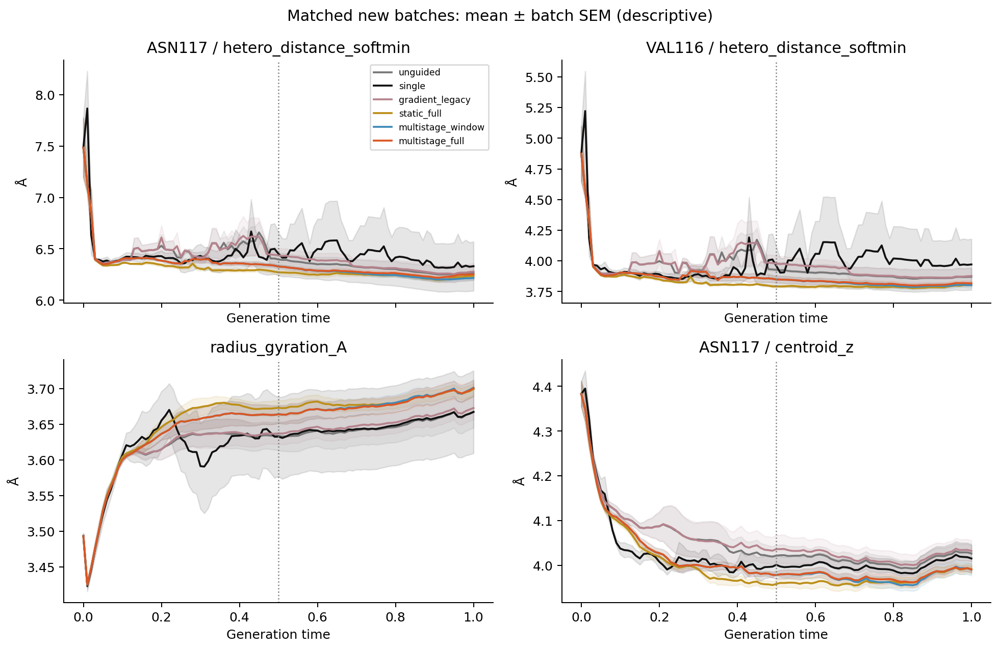
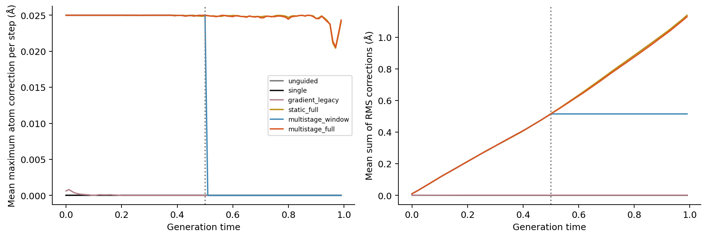
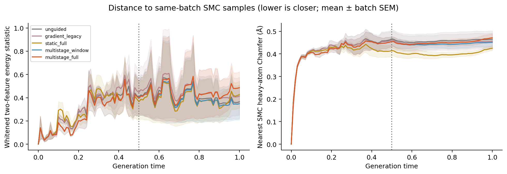

# CK2 多阶段奖励与全程 gradient guidance 实验

日期：2026-10-05。已完成 LLM Designer 模拟、25段奖励编译、60个pilot和384个独立对照候选。**全程100步引导已实现，选择窗口内的两项区域特征更接近SMC留存祖先；但尚未拟合SMC的完整终态结构，多阶段全程方案没有整体优于恒定目标。**本实验不更改之前统一分析 [0,.5] 全部选择节点的统计口径。

## 从 LLM 决策到可微程序

沿用用户授权的 subagent 接口模拟，由 Designer 读取 continuous-v3 的 discovery 分析和 Analyst 结论，选择 **ASN117、VAL116 的 N/O/S 条件距离作为一个相关区域目标**。LLM 负责解释证据、选择函数族和约束；数值原型、插值和推理均由确定性程序计算，没有额外训练奖励神经网络。参见 [Designer 原始决策](ck2_multistage_design.md)、[冻结实验方案](ck2_multistage_execution.md) 和 [执行审阅](experiments/ck2_multistage_20261005/Designer.execution_review.md)。

对每个真实评分时刻 t=0,.01,…,.50，从谱系反向累计最后一次选择留下的后代拷贝数，得到14个 discovery 批次各自的留存祖先特征代表 μ_b(t)。克隆只用于复原批次内的留存质量，14个独立批次在奖励中等权。背景尺度来自同时间无引导批次的内部协方差，不把跨时间漂移混入噪声。

令 z=(d_ASN117^NOS,d_VAL116^NOS)，距离沿用分析中的归一化 soft-min，温度 .25 Å。它不是最短接触距离或氢键能。奖励为：

\[
q_b=(z-\mu_b(t))^\top\Sigma(t)^{-1}(z-\mu_b(t)),\qquad
R(z,t)=\log\left[\frac1{14}\sum_b \exp\{-[\sqrt{1+q_b}-1]\}\right].
\]

采用相关混合势而非分别要求两个距离越小越好：发现集的上下尾部都存在选择减重，证据更适合支持靠近经验区域，不能支持无界吸引。原型是批次均值，尚不能当作14种已经识别的结合模式。

目标曲线采用自适应 PCHIP：在全部51节点上控制最大白化插值误差≤.1，得到 **26节点、25段**；最大误差 **.0996357381**、RMS误差 **.0220990090**。节点为：

`0, .04, .06, .08, .10, .11, .12, .13, .14, .15, .16, .17, .18, .20, .22, .23, .25, .27, .29, .31, .34, .38, .42, .45, .47, .50`。

这些是局部插值段，不是恢复 .1 时间分箱，也不是证明了25种生物学阶段。均值目标从 t=0 的 (6.4857,4.0395) Å 变为 t=.5 的 (6.2841,3.8257) Å；实际函数保留逐批曲线和相关尺度，没有只沿这两个均值端点画直线。协方差收缩10%并设置最小特征方差 .01 Ų，按51个时刻作正定凸插值。

在 .5<t<1 冻结 μ(.5)、Σ(.5)，持续维持末端参考。这是数据支持范围之外的**延续假设**，通过 window-only 对照检验，没有用后半程数据重新发现或拟合规则。

## 推理控制与权重

通过当前真实模型预测终态 y=hθ(x,t) 拉回梯度：g_x=J_yᵀ∇_yR。冻结模型参数、上一积分步和历史自条件；N/O/S 来自当步预测类别，求导时固定，下一步重新计算。缺少 N/O/S 的粒子跳过并保存缺测，不能补成完美奖励。

原生积分得到位移 u 后，沿梯度施加修正，目标 RMS 为 **η×RMS(u)**。每原子每步附加位移≤.025 Å，累计已接受 RMS 路径≤2.5 Å，并相对同一个 native proposal 检查新增<1.2 Å的局部受体接近及配体成对距离改变；失败则缩小或撤销本次附加修正。native 的步长已包含 dt，归一化后不再乘一次 dt。

这里须区分函数内部尺度与外部控制强度：Σ 决定两个相关特征的相对方向，η 决定请求位移。由于方向归一化，给整个奖励再乘统一常数通常会被抵消；增加名义权重也可能只增加裁剪。本实现记录请求和实际 RMS、裁剪、回溯、分量冲突、混合责任度与后半程活动。

全程组在 **t=0,.01,…,.99 的100个积分步**都计算并尝试注入梯度；t=1 是最终原生输出，不额外做第101次注入。所有 gradient 组不进行 SMC 重采样。最终保留原生模型终态处理。每阶段结构进入已验证的 HDF5 轨迹，不积累重复的逐步结构缓存。

单步与累计约束是附加位移约束，不保证后续原生流放大后的最终偏移上界。几何约束不等价于真实能量安全；整个 native+guided 步也没有奖励单调上升保证。

## 校准和独立对照

checkpoint 为 `flowr_root_v2.ckpt`，SHA256 为 `f28e863b2b208718f3d3f85f09837c2f907a71123436db6f98a25d2f1858b6a0`。沿用100步、固定25原子槽、同初始先验和配对种子，实际 integrator 使用 SDE、coord_noise_level=.2。原始 config 的 `flowr_args` 是解析器参数快照，随后源码覆盖了 integrator；`selection_mode` 描述的是 SMC，梯度模式应读取 `extension`。这些历史记录原样保留，不能按旧字段误判为无梯度或无 SDE。

pilot 使用新种子20261015，各12个，共60个候选。零权重组与无引导组的坐标、原子、键、电荷和mask全部逐位一致。真实模型方向差分的相对误差随 ε=.001/.003/.01 分别为1.0925%/.3114%/.0710%；模型参数未积累梯度。它验证实际链式梯度的一次方向检查，不代表穷尽所有类别切换点。

| pilot 强度 η | 有效且连通 | 裁剪比例 | median(实际/请求 RMS) | median(实际/native RMS) | 平均累计 RMS 路径 Å |
|---|---:|---:|---:|---:|---:|
| .05 | 11/12 | 1.00% | 1.0000 | .0500 | .2743 |
| .15 | 12/12 | 13.67% | 1.0000 | .1500 | .7769 |
| **.30** | **12/12** | **90.50%** | **.7158** | **.2147** | **1.1346** |

三个候选都通过预声明工程门槛；选最高可行的 **η=.30**，不按亲和力选择。这不是最优权重。pilot 基线11/12有效连通，失败结构保留；校准的末态碰撞条件只针对可测的已构建分子，另行评价所有 raw 终态结构。RMS可用性和late边界修正后，冻结的可行性与所选η不变。

独立比较使用新种子20261105，4批×16候选/组，共384个：无引导、单目标SMC、旧早期奖励、恒定末端目标全程引导、多阶段仅窗口引导、多阶段全程引导。SMC在0–.5每步重采样，共51次；每批16粒子与历史发现集50粒子不同，本轮内部匹配。统计以4个批次为独立单位；逐候选、逐帧和克隆不增加自由度。四批双侧精确sign-flip最小p=.125，本轮只支持探索性结论。

## 实际结果与解释

正式比较中，多阶段全程组 **6400/6400 粒子步**有可用且实际非零的注入；每批100步均生效，严格 t>.5 的非零比例为100%。实际/native RMS中位数为 **.212178**，实际/请求为 **.707261**，91.34%粒子步触及位移上限，平均累计附加RMS路径 **1.129424 Å**。几何回溯和完全拒绝均为0。恒定目标组也全程生效；仅窗口组51步、累计 .515093 Å；旧奖励实际只在19步生效，平均累计 .001511 Å。

24条完整轨迹和初始先验配对通过审计。full/window 四批的当前坐标、原子、键、电荷及predicted endpoint在 t=.51 之前逐位一致，proposal至t=.50逐位一致，证明后续差异产生于续程控制，而非不同起始样本。分量梯度和总梯度的范数恒等式检查通过；不能把分量视为互不相关的独立机制。

| 方法 | 有效且连通 /64 | CK2模型重评分均值，全部候选 | 全组唯一SMILES数 |
|---|---:|---:|---:|
| 无引导 | 62 | 7.474923 | 41 |
| 旧早期奖励 | 60 | 7.525258 | 39 |
| 单目标SMC | 63 | 7.588715 | 37 |
| 恒定末端目标，全程 | 63 | 7.633972 | 34 |
| 多阶段，仅窗口 | 61 | 7.602795 | 40 |
| **多阶段，全程** | **61** | **7.621626** | **39** |

均值采用批次等权。模型评分也保留构建失败候选；只统计有效分子的评分另表保存。唯一SMILES列是全组去重计数，与批内独特比例不是同一个指标。全部384个raw终态的重原子局部口袋几何均可测，未发现<1.2 Å原子对；这只验证该局部几何阈值。来源：[终态完整表](experiments/ck2_multistage_20261005/comparison/outcome_summary.csv)、[配对统计](experiments/ck2_multistage_20261005/comparison/paired_outcomes.csv)。

full相对无引导的预测评分差为 **+.146702**，四批配对95% t区间 **[−.117095,.410500]**，精确sign-flip p=.25。full相对window仅 **+.018831**，4/4批为正，但区间 **[−.002835,.040496]**、p=.125；有效率相同。full相对static为 **−.012347**，区间[−.147022,.122329]。这些都是既有模型输出，不是真实结合亲和力，不能宣称显著提升。

结构相似性明确区分三种SMC参考：当步筛选前全部候选、按当步offspring复制的筛选后种子、按t=.5后代拷贝回溯的留存祖先。没有把被淘汰候选混称为“留下来的seed”。完整曲线和两种选择参考分别保存；补充选择参考评价在读取独立结果前加入，没有回改奖励。

| 方法 | 0–.5 留存祖先二维距离↓ | 0–.5 留存祖先Chamfer Å↓ | 终态SMC二维距离↓ | 终态SMC Chamfer Å↓ | 终态最近SMC指纹相似度↑ |
|---|---:|---:|---:|---:|---:|
| 无引导 | .381596 | .494768 | .364422 | .464937 | .442193 |
| 恒定目标，全程 | .356468 | .477044 | .425646 | .425174 | .463711 |
| 多阶段，仅窗口 | .339106 | .484476 | .348011 | .451102 | .416477 |
| **多阶段，全程** | **.339106** | **.484476** | **.486063** | **.471449** | **.416004** |

二维距离为白化后经验energy statistic，**不是分子能量**；窗口列为对全部51时刻积分后的均值，未分成.1子区间。Chamfer为固定受体坐标系的重原子对称最近邻形状距离，不旋转对齐、不虚构原子对应。指纹为有效分子的Morgan半径2、2048位、非手性Tanimoto；其覆盖数和SMC参考数逐批保留。来源：[选择参考逐批表](experiments/ck2_multistage_20261005/comparison/selection_reference_imitation_batches.csv)、[全过程模仿表](experiments/ck2_multistage_20261005/comparison/imitation_batches.csv)、[指纹表](experiments/ck2_multistage_20261005/comparison/final_fingerprint_similarity.csv)。

多阶段在选择窗内的二维距离比无引导降低 **11.13%**，4/4批同向，差值−.042490，95%区间[−.115721,.030742]；形状距离降低 **2.08%**，3/4批同向。它捕捉到了部分区域选择特征。另一方面，full终态的二维距离高于window **.138052**（4/4批），Chamfer也较差；相对static，二维距离高 **.060417**、Chamfer高 **.046275 Å**（均4/4批）。最终指纹相似度没有改善。

后半额外注入 .614331 Å，占full累计剂量约54.4%，却仅得到+.018831模型评分，同时没有提高有效率、也没有改善结构拟合。**持续生效已经实现；“持续生效越强就越接近SMC”不受本轮支持。**由于window和full累计剂量不同，不能只把差异归因于阶段数量。静态方案也不能称为全指标最优：它的全组唯一SMILES较少，且其终态二维分布距离仍高于无引导。

下一轮最有依据的假设是：**保留后半程可用的梯度通道，但降低已贴近目标时的实际剂量，检验冻结.5参考是否与native末态处理失配。**例如预先冻结一个平滑、非零的后半η(t)下限，并让超出经验容许带的偏差决定强度；与恒定η做新种子的、尽量匹配累计剂量的比较。当前归一化会把很小但可用的梯度也放大到请求强度，91%裁剪也说明继续增大η缺乏依据。

另一条独立假设是提高结构可识别性：在已保存的留存祖先中提取带类型的三维接触密度、方向性接触和局部软原子组成，再用真实分支代表或medoid取代可能抹平多峰的批均值，并加入可微的化学几何约束。两项距离无法唯一决定25原子结构和键图；这些附加约束应分别做消融，不能仅为了提高本次比较分数继续堆项。物理能量和氢键机制需要新的可验证证据。本轮没有在读到结果后重调奖励或重选强度；后续假设尚未执行。

## 可复用入口与数据

- 原型提取／程序编译：`scripts/build_multistage_reward.py`；LLM提示与skill：`prompts/Designer.multistage.txt`、`skills/multistage-designer/SKILL.md`。
- 实际推理：`scripts/generate_multistage_flowr.py --flowr-root <FLOWR目录> ...`；控制器：`src/evomolsteer/generation/multistage_controller.py`；奖励：`multistage_reward.py`。
- 远端封装：`FLOWR_ROOT=/root/private_data/MolSteer/flowr_root bash scripts/scnet_multistage_experiment.sh pilot|comparison`。新的运行应使用独立 `EXPERIMENT_ROOT`，脚本拒绝覆盖已完成的campaign。
- 独立评价／审计：`evaluate_multistage_runs.py`、`audit_generation.py`、`audit_multistage_execution.py`；绘图：`plot_multistage_results.py`。
- 归档与恢复：`archive_generation.py`、`verify_generation_archive.py --archive <tar.gz> --metadata <tar.gz.json> --destination <新目录> --report <json>`。传输包和内部每个文件均校验SHA256，拒绝覆盖既有目标。

本地 source 先经 VPN 推送 GitHub，再由远端拉取运行。pilot生成提交 `3322d21`，独立比较生成提交 `45b0cea`；评价提交另行记录。奖励程序SHA256：`036f03d27a50b2f8a66f170e16bbaf4a3463f1505b62723bb2c0e682be3f50b3`。冻结原型的LF/CRLF哈希区别已用[独立勘误](experiments/ck2_multistage_20261005/provenance_normalization.json)说明，未回改已执行奖励。

远端工作目录：`/opt/evomolsteer-multistage-20261005`。归档位置：`/root/private_data/MolSteer/flowr_root/experiments/evomolsteer_multistage_20261005/`；使用 /opt 工作目录是为避免占满 private_data。原始候选、失败对照、谱系、评分和配置均保留于归档。

本地生成归档恢复到 `data/multistage_pilot_generated`、`data/multistage_comparison_generated`；分析结果保存在 `results/multistage_v1`，小型审阅产物同步到 `docs/experiments/ck2_multistage_20261005`。本次74项本地测试通过；854个归档文件逐一校验，18张本地／远端评价表在绝对和相对1e−10容限内一致。详见[复算报告](experiments/ck2_multistage_20261005/cross_host_evaluation.json)、[审阅问题处理](experiments/ck2_multistage_20261005/validation_resolution.md)、[Designer结果复核](experiments/ck2_multistage_20261005/Designer.outcome_review.md)。

| 归档 | 压缩字节数 | 内部文件数 | SHA256 |
|---|---:|---:|---|
| `multistage_pilot_v1.tar.gz` | 18,361,934 | 150 | `f61beddb8b40da0630b3aa1f7b0ed1fb89ec02386b059888b48d218aa5222a03` |
| `multistage_comparison_v1.tar.gz` | 112,975,174 | 704 | `0c38ba15fff5a8ee8f463aaaa2cf608ca92d20c53963477f868b9b86fece0b5d` |

比较归档同时包含已验证的评价快照和冻结pilot校准。评价提交为 `3b742f1`；它与生成提交分开记录。归档不上传GitHub，源码、冻结配置、方法、审阅结果和小型结果表上传仓库。
