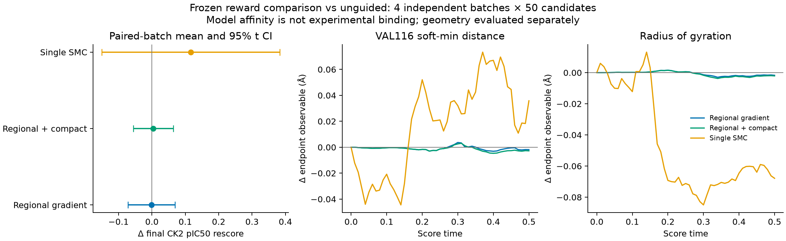

# CK2 单目标：选择特征、局部奖励与 FLOWR 梯度实验

本报告分开记录选择证据与干预结果。原始单目标数据完整；新分析已经在本地和远端各执行一次。**已完成 800 个正式比较候选和 24 个 pilot 候选，全部代码在本地提交、推送后由远端拉取运行。梯度执行链通过验证，但本轮两项几何规则尚未显示明确的最终 CK2 评分提升，不能据此宣称已替代 SMC。**

## 数据和分析口径

历史目录为 `/root/private_data/MolSteer/flowr_root/experiments/ck2_clk3_lineage_20261003/`。`main1000_w050` 的 single 与 unguided 各 20 批、每批 50 个候选，40 个 NPZ 的 SHA256 与本地原始副本全部一致。配置 SHA256 为 `4ac951f173b3de6ce6e64e8eec9dd3e7935d151fbbff33865cd2c16ef318ca8e`。

分析由真实 `resampled` 标记确定范围：评分时刻 0、.01、…、.50，共 51 个事件。t=.50 的 proposal 在积分后约为 .51，但它仍是最后一次选择的对象。0.5 后的生成状态没有进入规则发现。

只提取 single 和匹配 unguided 的预测终点、proposal 两种表示，共 204,000 行、255 个特征。14 个发现批次用于阈值、PCA 和规则；验证/留出各 3 批。每次事件内部比较，然后先对每批阶段内的事件取平均，最后对独立批次统计。连续帧、子代、克隆不充当独立重复。零子代表示当次未被复制，不等于终态失败。

远端从 GitHub 拉取 `e1f33cd` 后运行同一分析。11 张主要 CSV 的标签、缺失情况和显著性判定一致；跨平台最大数值差异约 1.0×10⁻¹¹，来自浮点运算/序列化，不是逐字节完全一致。正式统计、批次表、变化率、PCA 基底及对照均保留。

## 可以提出的优化方向

下表均为发现集预测终点的**期望选择偏移**：`Δf = Σ pᵢfᵢ − mean(f)`，单位 Å。它测量被评分机制偏好的几何分布，不能直接读成每个原子需要移动多少。

| 区域/特征 | [0,.1) 偏移 | [.1,.2) 偏移 | 可检验的解释与方向 |
|---|---:|---:|---|
| GLU114 距离 | −0.004825，q=.00502 | −0.002031，q=.04677 | 铰链附近的一侧保持接近 |
| HIS115 距离 | −0.007481，q=.00502 | +0.004695，q=.02110 | 偏好发生阶段反转，不宜全程吸引 |
| VAL116 距离 | −0.008450，q=.00502 | +0.003860，q=.02849 | 早期接近最稳定，后续应释放这一吸引 |
| ASN117 距离 | −0.006715，q=.00502 | +0.004246，q=.02376 | 与相邻残基共同提示阶段性空间安排 |
| ASN118 全原子距离 | +0.006051，q=.00502 | −0.000612，q=.88068 | 不能把整片区域统一定义为“越近越好” |
| ASN118 N/O/S 距离 | −0.036005，q=.00502 | −0.002574，q=.27861 | 化学类型相关的定向安排候选，不能由距离确认氢键 |
| 配体回转半径 | −0.000473，q=.56117 | −0.006041，q=.00502 | 后一阶段轻度紧凑化，与区域吸引分开测试 |

VAL116 在 [0,.1) 的 95% 批次 bootstrap 区间为 [−0.009739, −0.007143]，14/14 批方向为负。回转半径在 [.1,.2) 的区间为 [−0.007930, −0.004120]，同样 14/14 批为负。CK2 的显著 endpoint 特征数依次为 38、36、8、0、0；这并不把高度相关特征当作 38 个独立机制。

变化率进一步说明时间门为何必要：VAL116 的阶段偏移从 −0.008450 变为 +0.003860，阶段效应变化率约 **+0.12310 Å/单位 flow 时间**，q=.00579；HIS115 为 +0.12176，ASN117 为 +0.10961。回转半径变化率为 −0.05568，q=.00579。这些是“选择偏好效应的导数”，不是原子速度，也不是坐标梯度。

**优势原因的工作假设**是铰链附近的占位和取向得到早期筛选，随后伴随构象收紧及局部重新安排。原结构 [3PE1](https://www.rcsb.org/3d-view/3PE1) 是 CK2α–CX-4945 复合物；[高分辨率结构研究](https://pmc.ncbi.nlm.nih.gov/articles/PMC3795567/) 和 [His115 生化研究](https://pmc.ncbi.nlm.nih.gov/articles/PMC10794401/) 为该区域的铰链作用提供背景。这里的几何代理没有供受体类型、取向角和水网络，不能据此断言新分子形成了这些相互作用。

改进方向有层次：先测试 VAL116 代表的早期区域位置；再单独测试回转半径；若进一步扩展，应检验 GLU114 与 VAL116 的相对位置、ASN118 的类型条件方向，以及时间依赖原型。后两类尚未加入本轮冻结奖励，避免由多个相关距离累加出过强吸引。

### 必须保留的反证

- VAL116 的选中–淘汰差异约 −0.01120 Å，q=.01448；同一父节点的 endpoint 同胞差异恰为零。选择实际上在复制相同的预测终点，不能把大量克隆计作新证据。
- 相应 proposal 的选择效应没有获得同等统计支持。发现的是模型预测终点的偏好，实际生成状态的优势还需要干预验证。
- 加权与均匀原型高度重叠：VAL116 中位数 4.374834 vs 4.380067 Å；回转半径 3.587681 vs 3.594393 Å。这是弱偏好，不能把加权中位数当作最优结合几何。
- 冻结后，两项规则在验证集和留出集中均为 3/3 批同向；每组只有三批，仅作方向复核，没有新显著性声明。VAL116 验证/留出偏移为 −0.010841/−0.007863 Å；回转半径为 −0.006289/−0.007915 Å。

零同胞效应还有明确的执行原因：上游顺序是先预测/评分，再由积分器产生 proposal，然后按先前评分重采样。同一父节点复制出的当前状态和 self-conditioning 可以完全相同，因而本步 endpoint 预测也相同；本步积分新加入的噪声尚未进入这次评分。这进一步说明，阶段效应和它的变化率不能直接替代空间梯度。若后续研究要识别“哪种局部变化真正增加下一步评分”，需要时间滞后对照或对未被复制的 proposal 进行显式反事实评价，不能把现有同胞零差异改写为学习成功。

## 奖励函数与执行链

令 `y=hθ(xₜ,t)·coord_scale+COM` 为同一次 live forward 的世界坐标预测终点。区域特征为归一化 soft-min：

\[
d_V(y)=-\tau\log\left(\frac{1}{NM}\sum_{i,j}\exp[-\|y_i-r_j^{VAL116}\|/\tau]\right),\qquad\tau=0.25\mathrm{Å}.
\]

它不是最短接触距离。另一个特征为全活跃配体原子的回转半径 `Rg(y)`。对任一特征 z，定义：

\[
u=\max((z-m)/s,0),\quad
\phi(u)=\begin{cases}u^2/2,&u\le1\\u-1/2,&u>1.\end{cases}
\]

区域奖励 `R_V=−g₀(t)φ((d_V−4.374834436)/0.127568599)` 只在 [0,.1) 生效；紧凑度奖励 `R_C=−g₁(t)φ((Rg−3.587680966)/0.074939683)` 只在 [.1,.2) 生效。上述 φ 定义已包含正部截断。m 是发现集概率加权中位数，s 是均匀候选的标准差；没有训练额外拟合模型。时间门包含 .02 宽度的 smoothstep 收尾/起始，t=0 的第一阶段直接启用。

与双侧 IQR 窗口相比，单侧函数不会把已经低于目标的样本重新推大；与线性吸引相比，它在达到目标后停止。固定阶段中位数不是逐时刻最优轨迹；其作用偏重较早、距离较大的预测。这是本轮简约假设的明确限制。

参考 MolThinker 的目标–函数选择与 MolExecutor 的原生积分联动，实际控制为：

\[
g_x=\nabla_{x_t}R(h_\theta(x_t,t)\,s_{coord}+COM),\qquad
x_{t+\Delta t}=\operatorname{NativeStep}(x_t)+\operatorname{Cap}(0.05\,\Delta t\,g_x).
\]

每个分子用一个缩放系数把单步最大附加原子位移限制为 .025 Å，保留其整体梯度方向。坐标梯度经过真实生成网络 Jacobian；上一时刻 self-conditioning 被 detach，不进行全轨迹反向传播。参数权重固定，梯度组不调用重采样。原生积分、类别采样、噪声、末态模型头和解码继续执行。cap 只限制附加位移，不能保证无碰撞或真实亲和力改善。

## 已完成的程序验证

- 本地 51 项测试通过，包括存储、选择范围、数值梯度、单位转换、时间门、批次不缩放、统计独立单位等。
- 8 样本 pilot 的零权重最终 coords/atomics/bonds/charges/mask 与原生流程逐位一致。
- Pilot live pullback 有限差分最佳相对误差 3.16%，较小扰动约 17.5%，记录浮点数值局限；50 样本正式比较的最佳误差为 0.399%。两次均无模型参数梯度。
- Pilot 三组各 8/8 分子构建成功，均连通，未检出低于 1.2 Å 的受体碰撞。regional / regional+compact CK2 均分约 7.43181，零权重基线 7.50291，未显示亲和力改善。
- Pilot 实际最大单步修正约 .002463 Å，没有触及 .025 Å cap。完整轨迹、失败对照、分支和控制日志都保留。

## 正式配对比较

生成运行版本 `9eae1cc`；远端完成后拉取 `84d5211` 执行比较、审计、梯度诊断和打包。新种子 20261005，四个独立批次，每组共 200 个候选。使用与历史数据同 SHA256 的 v2 checkpoint。FLOWR 源仓库 HEAD 为 `739a33c2aab74d074dd24605b9a2e34dc809ae9c`，tracked 文件干净；另外记录了 123 个 Python 源文件的 SHA256。

| 生成组 | CK2 模型均分 | 相对无引导差值 | 配对批次 95% t 区间 | 构建成功且连通 | 全组不同 SMILES |
|---|---:|---:|---|---:|---:|
| 无引导 | 7.497807 | — | — | 191/200 | 124 |
| 单目标 SMC | 7.614362 | +0.116556 | [−0.149791, +0.382903] | 187/200 | 86 |
| 区域梯度 | 7.496439 | −0.001367 | [−0.071952, +0.069217] | 192/200 | 126 |
| 区域+紧凑度梯度 | 7.501939 | +0.004133 | [−0.055642, +0.063908] | 192/200 | 125 |

这里是模型预测评分，不是实验测得的结合亲和力。四组在成功构建且完成距离测量的结构中均未检出低于 1.2 Å 的严重受体重原子碰撞，这不等于全面的构象/能量验证。不同 SMILES 是全组计数；CSV 另外保留每批重复率，二者不能混用。

区域梯度、组合梯度相对单目标 SMC 的均分差分别为 −0.117923、−0.112423，配对区间同样跨零。只有四个独立批次，精确双侧 sign-flip p 值的理论最小值是 .125；本轮三组对基线的 p 分别为 1.000、.750、.375。因此均值排序是描述性结果，既不能证明梯度有效，也不能把它解释为严格证明 SMC 普遍优于这种方法。

### 实际控制幅度与几何响应

- 所有梯度组的重采样次数为零；SMC 每批确为 0–50 号积分步的 51 次选择。
- 正式比较中，最大附加单步原子位移为 **0.016263 Å**，未触及 .025 Å cap；最保守的逐步最大位移累加上界为 0.021879 Å。这个设置属于很弱的干预，没有与 SMC 校准成相同的分布改变幅度。
- t=.09 时，区域梯度相对基线使 VAL116 指标平均降低约 **0.000588 Å**，SMC 的对应差异约 −0.025221 Å。区域规则确实产生了预期方向的微小早期变化，但效果大小远小于 SMC。
- t=.19 时，组合梯度的回转半径仍比基线高约 +0.001331 Å；相比区域梯度单独使用的 +0.001397 Å，只表现为很小的相对收紧。没有证据表明这项追加项已经成功复制 SMC 的紧凑化轨迹。
- 末态两个梯度组的区域距离、回转半径差异区间均跨零。局部 reward ascent 不保证经过后续随机积分和类别采样后仍保持优势。

### Live 梯度方向诊断

独立脚本从无引导第 0 批的 t=0、t=.1 restart 重新构造同一次 forward。两次 endpoint 和亲和力评分相对保存值的最大误差均为 **0**，再分别对“降低几何特征”和亲和力头求当前坐标梯度。

- t=0 的区域方向与亲和力梯度平均余弦约 **0.267**，37/50 个候选同向；在超过单侧停止目标的 38 个候选中，只有 28 个同向。
- t=.1 的回转半径降低方向平均余弦约 **0.270**，45/50 同向；超过停止目标的 31 个候选中有 28 个同向。这里评价的是下一阶段将使用的原始几何方向，t=.1 的实际 smoothstep 起始门为零。
- 这些结果说明两项区域假设有部分局部依据，也存在反向候选。它们是冻结生成模型上的局部导数，不是末态有效性的证明，更不是实验生物学验证。诊断没有用于回调本轮奖励参数。

## 后续改进应针对什么

1. **先校准干预幅度，再评价替代能力。** 本轮最大累计修正很小，且两项几何代理没有包含 SMC 所使用的完整亲和力信息。可用独立 pilot 按几何响应和有效性预先选定强度，再冻结后用新批次评估；不能把本次比较集用于挑选最佳参数后继续称其为独立测试。
2. **把阶段原型细化为时刻条件原型。** 固定阶段中位数混入了自然生成漂移。可从 discovery 的同一时刻候选计算 m(t)、s(t)，并检验 GLU114 维持接近、VAL116 后续释放/调整的相对位置规则，而非简单堆叠邻近残基吸引。
3. **补足化学条件与方向证据。** ASN118 的全原子和 N/O/S 信号相反，说明“任意原子接近”可能过于粗糙。应核验原子类型、供受体/取向、碰撞及图稳定性后再扩展函数；当前数据不支持直接命名氢键机制。
4. **增加时间滞后与反事实验证。** 利用保留的 proposal、父子关系和 checkpoint，检验哪些局部变化改善下一步预测，尤其关注未被复制的候选；将选择关联和干预收益分开。
5. **使用已有亲和力头梯度作为另一个对照。** 这不需要训练额外模型，有助于区分几何代理不足、强度不足和长程生成动力学的影响。本轮只做方向诊断，未把亲和力头加入奖励或冒称已运行该对照。

通用 LLM 在这里承担的是基于确定性证据选择区域、阶段和函数形式；坐标特征由数值程序测量，梯度由 PyTorch 求导。这一分工不需要额外拟合网络，但也不能从有限筛选谱系唯一识别所谓“最优生成路径”。

## 文件位置与复用

- 本地分析：`results/single_ck2_v1/`；远端复算：`experiments/evomolsteer_single_guidance_20261004/analysis_single_v1/`。
- 冻结程序：`configs/experiments/ck2_single_guidance_v1/`；函数实现：`src/evomolsteer/generation/scalar_guidance.py`。
- 运行入口：`scripts/generate_gradient_flowr.py`；独立比较：`scripts/compare_gradient_runs.py`；阶段方向复核：`scripts/summarize_single_hypotheses.py`。
- 使用说明：[gradient_generation.md](gradient_generation.md)；设计与预声明：[ck2_single_guidance_design.md](ck2_single_guidance_design.md)。
- Analyst 和 Designer 通过用户授权的 subagent 模拟完成。Analyst 通过既有 schema/语义校验；live Designer 使用独立设计文档，不把旧版 saved-endpoint 契约冒称为已完成的 live 执行验证。

## 归档与完整性

正式生成数据包已经下载到本地 `data/single_guidance_comparison_v1.tar.gz`，211,877,340 字节，SHA256 `f73daf90f44cc68f3a77fee227523bb8d4e19ffe9e50ff3303e5e41ebfff4166`。包内 449 个文件逐一核验通过，本地又验证了 16 份 HDF5 的全部 28 个字段以及 79,200 条坐标父子关系。所有 800 个终态记录均保留，包括构建失败的 38 个候选；失败数量按四组相加。

解包数据位于 `data/single_guidance_generated/results/comparison_v1/`，对应远端 `experiments/evomolsteer_single_guidance_20261004/generated/results/comparison_v1/`。每一步转换、校验后回收临时阶段文件；没有生成冗余的原始 trajectory.npz。用于恢复上下文的 restart/RNG/endpoint 文件仍保留，完整历史数据没有删除。

正式比较与诊断位于 `results/single_ck2_v1/generation_comparison/`、`results/single_ck2_v1/gradient_alignment/`；完整压缩包另含 `GENERATION_ARCHIVE_MANIFEST.json`，本地下载核验记录为 `test/single_guidance_v1/download_verification.json`。
