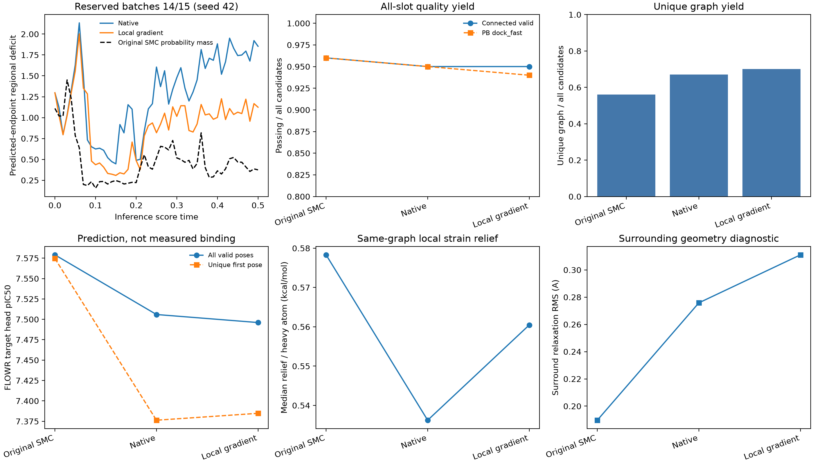

# CK2：局部选择规则、真实梯度与终态评价（seed 42）

**本次已完成5轮，到此停止。局部特征控制可以延续至预留批次；整体 Steer 中间结构复现与周围兼容性提升尚未得到支持。** 所有新实验关闭 SMC，梯度只在学习窗口生效，随后原生推理完成至 t=1。每轮的远端旧结构、轨迹与传输包都在下一轮启动前删除；原始 Steer、输入和 checkpoints 保留。最后一轮也执行报告保留后的清理，审计见下文。

## 实验范围与可复现性

主 seed 固定42；采样 seed 按 `42+100003*global_batch_index` 固定派生。开发组为批次0/1；第5轮为批次14/15，每臂100候选、每批50、100个积分步。原始先验坐标、原子及键标签的校验值与新组全部一致。原生类别抽样和 SDE 保留，所有粒子选择索引均为恒等，没有新 SMC 的复制或淘汰。

奖励参考只使用发现批次0–13。批次14/15未进入奖励中心、协方差或本次调参；历史14–19的聚合统计曾被查看，因此称为**预留批次检验**，不称全盲、新主 seed 或跨靶点验证。第3/4轮复用了同一开发样本，其重复结果不能算作新的独立样本。

| 轮次 | 本轮主要变化 | 新生成候选数 | 结果用途 |
|---|---|---:|---|
| 1 | 全局 actual-state MMD 对照；局部 full-pullback，η=.1 | 300 | 局部组质量退化，停止采用 full-pullback |
| 2 | η=.1不变，梯度投影到区域与一键邻居 | 100 | 局部指标改善，终态兼容性未改善 |
| 3 | 仅η=.1→.2 | 100 | 更强局部效应；能量未随之改善 |
| 4 | 冻结η=.2；加 native/zero 对照 | 300 | 两批全100步和final tensor逐字节一致，复现第3轮主要指标 |
| 5 | 奖励/η冻结，改用预留批次14/15 | 200 | 局部控制延续；实际整体形状与兼容性未确认改善 |

合计1000个新候选包含零对照、native和重复验证，不应当作1000个独立效果样本。各轮配置、公开设计依据、失败分母和代码标识保存在 [实验目录](experiments/ck2_terminal_seed42_20261005)。第4轮推理 commit `1c95cd3356e120a6f5b05bbd688daec2a4fb0250`；第5轮 `e566bc4f10e70c1846e5b0ffb1bc6f746062d262`。

## 优势区域假说与奖励构造

发现集的选择关联支持考察受体 ASN117/VAL116 周围的 N/O/S 距离分布，不能据此断言这些原子形成了特定氢键或具有因果作用。该特征是归一化 soft-min 统计，并非某个原子的直接接触长度。两端富集结果不支持无界“越近越好”，因此采用相关的有容忍范围目标。详细证据及函数来源在 [Designer计划](experiments/ck2_terminal_seed42_20261005/Designer.plan.json)。

对全部实际观测时间统一使用参考，不切分0.1宽区间。参考覆盖本例0–0.5的51个评分节点，保存每时刻选中概率均值 μ(t)、无引导批内协方差 Σ(t) 和加权50%质量半径 r²(t)。协方差采用显式收缩与数值下限；椭圆可能跨越多峰空隙，50%本身是设计假说，不能冒称完整分布或最优区域。

令 z 为两维局部距离：

\[
q=(z-\mu)^T\Sigma^{-1}(z-\mu),\quad
v=\max(\sqrt{q/r^2}-1,0),\quad
R=-\big(\sqrt{1+v^2}-1\big).
\]

椭圆内部梯度为零；外部使用稳健惩罚。缺少N/O/S时记为不可用并零注入，不能记为满足目标。本轮两组的窗口特征可用性均为100%。时间变化由真实节点的经验参考直接约束，不将时间导数误当成空间梯度，也不通过高阶多项式外推生成最优路径。

设 Fθ 为真实 FLOWR endpoint 输出。PyTorch 计算当前坐标到 Fθ 的向量-Jacobian乘积，再经区域掩码投影：

\[
g_t=P_t\,J_{F_\theta}(X_t)^T\nabla_{F_\theta}R.
\]

模型参数冻结；硬原子/键标签与 self-conditioning detached。Jacobian没有替代拟合模型，也没有显式构建大矩阵。LLM提出特征与解析函数族，确定性程序提取 μ/Σ/r；空间导数由真实模型和奖励计算，不能说LLM直接从坐标文本掌握了真实梯度。投影后方向是有约束控制方向，不等同于原标量奖励的完整梯度。全局MMD对照直接作用于 actual state，不经过 endpoint Jacobian。

注入请求为 `η*native_RMS*v/sqrt(1+v²)`，再执行每原子0.025 Å上限、累计RMS预算1.25 Å、原生 proposal 相对几何回溯。η=.2不是0.2 Å位移。本例最后一次干预为 .49→.50，之后严格零注入至t=1；参考和控制窗口由文件动态读取，控制器不硬编码0–0.5。原子、键、形式电荷没有直接的连续奖励梯度，本次是坐标控制实验。

## 开发与预留结果必须区分

开发批次0/1第3轮：预测 endpoint 的 t=.5局部偏差由1.665875降至1.057099，降低36.54%；整个窗口的时间平均偏差降低约23.2%。实际 X_.5的双向最优几何匹配RMS由0.237427降至0.225154 Å，改善5.17%。第4轮复现这些主要结果，并通过完整零对照。

预留批次14/15的结果如下，各组100个候选：

| 指标 | 原始Steer | 新native | 局部gradient |
|---|---:|---:|---:|
| 连通且有效 | 96 | 95 | 95 |
| PB dock_fast通过 | 96 | 95 | 94 |
| 独特canonical图 | 56 | 67 | 70 |
| 独特scaffold | 41 | 59 | 61 |
| 有效pose FLOWR CK2 head | 7.57905 | 7.50592 | 7.49607 |
| 去重首次pose CK2 head | 7.57458 | 7.37632 | 7.38478 |
| MMFF局部应变释放/重原子，中位数，kcal/mol | 0.578302 | 0.536230 | 0.560457 |
| 周围重原子松弛RMS均值，Å | 0.189661 | 0.275824 | 0.311036 |
| 终态局部q/r²均值 | 5.66633 | 16.2640 | 13.0577 |

预留组的预测 endpoint 局部缺口由1.853519降至1.124273，降低39.34%；整个0–0.5窗口的时间平均缺口由约1.277179降至0.904283，降低29.20%。但实际 X_.5的整体几何匹配RMS由0.232838升至0.234196 Å，恶化0.58%。两维特征允许大量不同的三维结构，预测终点与实际当前状态也不是同一表征；因此不能把39.34%称作中间分子结构拟合提升。

相对同批native，gradient的MMFF应变释放高约4.52%、周围松弛RMS高约12.77%，有效pose预测head略低。去重数增加3个且去重head略高，但指纹多样性并未一致增加。原始Steer的去重数也从开发组的24变为此处56，不能将单批复制造成的限制当作普遍的自由度收益。第5轮95个有效分子的MMFF评价均收敛；PB-fast失败及5个结构失败全部保留在候选报告中。

完整小数、逐批效应、缺失/失败和初态校验见 [第5轮比较](experiments/ck2_terminal_seed42_20261005/round_05/comparison/comparison.md)、[逐批连续窗口积分](experiments/ck2_terminal_seed42_20261005/round_05/continuous_window_integrals.csv) 和 [原始初态配对](experiments/ck2_terminal_seed42_20261005/round_05/original_pairing.json)。

## 方法边界与下一步假说

PB dock_fast是结构检查子集。MMFF指标来自同图两阶段局部松弛：固定重原子调整氢，然后释放全部原子；它是应变释放，不能代表结合自由能或全局最低能。周围RMS是无蛋白力场的配体松弛诊断，不能独立证明受体环境兼容性。FLOWR head与原选择评分共享模型，不能证明实测亲和力提升。Hungarian指标是几何点云匹配，原子/键错配另存，不能视为同一化学图的分子RMSD。克隆、节点和时间不是独立重复，本次不提供虚假的粒子级显著性区间。

后续有依据的方向是保留局部平底目标，增加实际状态的区域几何一致性、键角/环平面等化学约束与周围可行性，先检查这些观测的来源和阶段适用性，再考虑耦合奖励。中间图尚不可靠时，可检验依据类别置信度调节的平滑几何约束；不能将终态MMFF直接冒充中间态能量，不能仅凭全窗统计时间斜率推出三维引导方向。本次未执行这些新假说，也未安排第6轮。

[Designer最终审阅](experiments/ck2_terminal_seed42_20261005/Designer.final_review.json) 保存了证据、结论和后续可证伪方向，不保存私有思维链。LLM接口及选择窗口学习流程仍可复用；当前奖励只是有来源的区域控制原型，不能称作已证明的最优演化路径。

## 运行、测试与清理

源码始终在本地修改、commit并经本机VPN push；远端pull后执行冻结推理。科学评价在本地运行。89项测试通过；完整零强度对照还在真实模型上验证了100步 current/proposal/prediction坐标、类别、评分、时间以及final tensors与heads。

入口：`scripts/generate_local_flowr.py --flowr-root <FLOWR_DIR>`；控制程序位于 `configs/experiments/ck2_terminal_seed42_v1`。`check_terminal_round_ready.py` 验证上一轮输出已删除、报告哈希、保护输入及下一轮科学门；收尾后设为closed，禁止继续推理。`summarize_regional_window.py` 对整个动态窗口积分，不分子区间、不忽略缺失节点。

每轮保留成功和失败的候选指标、连续趋势、配置、代码/数据哈希与比较报告。生成结构和坐标轨迹已退休，报告不能逆推出这些明细；需按冻结源码、输入、模型、seed和运行环境重新生成，不承诺跨GPU版本逐字节复现。

清理审计位于 [实验目录](experiments/ck2_terminal_seed42_20261005)：`cleanup_old_remote.json`、`cleanup_before_round02/03/04/05_remote.json` 和 `cleanup_final_remote.json`，另有对应local审计。原始 Steer目录和v2 checkpoint均受保护；checkpoint SHA256为 `f28e863b2b208718f3d3f85f09837c2f907a71123436db6f98a25d2f1858b6a0`。最终删除字节及任务关闭状态另存 `final_retention.json`。
