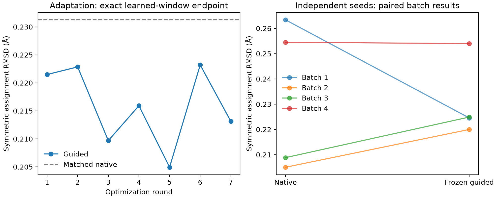

# 动态学习窗口内的 FLOWR 梯度拟合：八轮实验结果

2026-10-05。已完成七轮适配与一轮冻结配置的新随机种子验证，共生成 **416 个候选**，全部下载、校验并在本地分析。动态窗口、实际状态梯度和关闭粒子重采样均通过检查；**尚未得到稳定优于无引导对照的 Steer 中间态拟合效果**。

第三轮在适配种子上的形状距离降低 9.33%；固定其公式和参数后，第八轮新种子的平均改善只有 **0.89%**，四个配对批次中两个改善、两个变差。配对差值的 95% t 区间跨过零，参考覆盖方向略有退化。不能将适配成绩当作独立验证效果，也不能宣称恢复了原始 Steer 的分布、化学结构或优势路径。

## 1. 本次实际改动和执行范围

- 生成入口：[generate_window_flowr.py](../scripts/generate_window_flowr.py)，核心控制器：[window_controller.py](../src/evomolsteer/generation/window_controller.py)。支持指定 FLOWR 程序路径与 checkpoint。
- 窗口由输入参考和奖励 JSON 共同确定；不一致、没有精确参考时刻或积分网格不匹配时拒绝运行。通用控制器没有写死 0.5。本次冻结参考的窗口恰为 `[0, 0.5]`。
- 关闭 FLOWR 内置 Steer/SMC，不筛选、复制或淘汰生成粒子。保留新奖励的坐标梯度，并设置纯 native 与零强度对照。原生 SDE、原子类型和键类型抽样仍然执行。
- 远端只执行冻结的 FLOWR 推理、无损轨迹记录、校验和打包；参考提取、权重校准、结果评价和设计决策均在本地完成。
- 使用 `flowr_root_v2.ckpt`，SHA-256 为 `f28e863b2b208718f3d3f85f09837c2f907a71123436db6f98a25d2f1858b6a0`。第八轮生成版本为 `b08502be6e59305054a637bd358d06ab87ea3886`。

“无引导无 Steer sampling”与同一请求中的 gradient guidance 目标存在措辞冲突。本次按明确的梯度拟合目标执行：禁用内置选择，仅保留本项目的新坐标梯度；完全无引导作为单独对照。该执行解释已在运行前说明并保存在第一轮记录中。

## 2. 严格对齐学习和控制的时间

历史轨迹包含两种时间：`score_time=t` 对应实际 current 状态 `X_t`；积分后 proposal 的时间为 `state_time=s=t+dt`。该事件的选择复制 proposal。因此，历史 `score_time=.5` 的选择作用于 `X_.51`，不能将其称为严格的 `X_.5`。

本次目标为 `current_*[score_time=b]`，并与前一事件 `proposal_*[selected_indices]` 逐位核对。控制条件为：

\[
t\ge a,\qquad s\le b,\qquad s>t.
\]

本例有 51 个实际参考时刻，但只有 **50 次梯度注入**，最后一次是 `.49→.50`；`.50→.51` 不再注入。100 个原生积分步全部完成，0.5 后保持 native 演化，主评价只读取单独保存的真实 `window_state.npz`。没有通过把积分步数减半来改变步长。

更换范围时，先用 `build_window_reference.py --window-start <a> --window-end <b>` 从同一实际表示提取参考，再使奖励 JSON 的 `window` 与其相同。推理可省略窗口参数，自动采用参考范围；显式传入冲突范围会报错。动态 `[.2,.4]` 的门控已纳入测试。

## 3. 奖励如何从原始数据产生

参考使用原始单目标 Steer 的发现批次 0–13：每批每时刻 50 个实际候选，以确定性 medoid 提取两个代表，批次等权，批内代表质量按其覆盖的候选数计算。共 51 个时刻、1,428 个代表。冻结参考为 [reference.json.gz](../configs/experiments/ck2_window_iter8_v1/reference.json.gz)，约 1.59 MB，SHA-256 为 `dc5de026e4ad73534ab7d1b2c1d00f47844947361e621bbaff444804ead5f469`。

坐标用原始受体固定坐标系，以 `x_world=coord_scale*x_model+target_COM` 转换。不对配体独立做 Kabsch 对齐，不在不同分子的原子坐标之间线性插值。使用固定 25 个 active 槽位；它们不能自动解释为化学有效的 25 个重原子。每个时刻使用该时刻的参考，因此奖励随生成阶段变化；不再划分 0.1 宽子区间。

令 `Gσ` 为含两侧自核项的高斯点云 MMD²，`Aσ` 为坐标核乘硬原子类型 Kronecker 核的 MMD²，`B` 为各硬键类型的距离一阶、二阶矩差，距离用 3 Å 归一化。奖励为：

\[
L_r(q,s)=\operatorname{mean}_{\sigma}G_\sigma(q,Y_r(s))
+\lambda_A\operatorname{mean}_{\sigma}A_\sigma(q,Y_r(s))
+\lambda_B B(q,Y_r(s)),
\]

\[
R(q,s)=T\log\sum_r\pi_r\exp[-L_r(q,s)/T].
\]

先执行 FLOWR 的原生一步更新获得 `q_s`，再直接对这个实际 proposal 的坐标计算 `∇qR`。梯度按原生位移 RMS 与外部比例 `η` 定幅，再施加逐原子上限、累计路径预算和几何回溯约束。不会额外再乘一次 `dt`。奖励内部各项权重和整体控制强度分别校准。

**这里仍由 FLOWR.ROOT 生成分子，但新奖励不需要经过 FLOWR endpoint 的 Jacobian。** 求的是实际坐标上解析奖励的梯度。没有训练额外神经网络；冻结的经验参考与核函数仍是一种统计近似，不能称为完全没有模型假设。

原子类型和键类型是 detached 硬标签，因此 typed/bond 辅助项只产生坐标梯度，不直接更新类别概率。键距矩与排斥约束是几何代理，**没有物理能量、结合自由能或区域能量优化的验证**。实际中间态缺少一致有效的力场化学状态，未用不可靠的能量值替代。

## 4. 八轮配置、结果与决策

第一轮前冻结晋级规则：相对当前保留方案，主指标均值至少下降 2%，且两个适配批次均改善。这是工程选择阈值，不是统计显著性判据。第 1–7 轮使用相同适配种子 `20261205` 与两批各 16 个候选；初态哈希一致。第八轮种子 `20261225` 在第一轮记录中预先指定，四批各 16 个候选，公式和参数与第三轮相同，不参与调参。

主指标为固定受体帧下、Hungarian 原子指派 RMSD 的双向最近邻均值；越小越好。评价参考是发现集全部 **700 个**实际 `X_.5`，并非奖励的 28 个末端代表。先计算每批指标，再对批次取均值。

| 轮次 | 改动 | 主距离 Å | 对配对 native 的改善 | 决策 |
|---|---|---:|---:|---|
| 1 | 单尺度点云奖励，η=.1，T=.03 | 0.221494 | 4.22% | 一批变差，不晋级 |
| 2 | 第 1 轮改为 σ、2σ、4σ 三尺度 | 0.222855 | 3.64% | 一批变差，不晋级 |
| 3 | 返回单尺度，η 提至 .3 | 0.209689 | 9.33% | 两批改善，保留 |
| 4 | 第 3 轮温度改为 .003 | 0.215922 | 6.63% | 参考覆盖受损，不晋级 |
| 5 | 第 3 轮增加 typed 空间项 | 0.204933 | 11.39% | 均值更好，但一批比第 3 轮略差，不晋级 |
| 6 | 第 3 轮增加硬键距离矩项 | 0.223204 | 3.48% | 两批均劣于第 3 轮，不晋级 |
| 7 | 第 5 轮逐原子上限 .025→.040 Å | 0.213129 | 7.84% | 增大剂量后退化，不晋级 |
| 8 | 冻结第 3 轮，独立新种子确认 | 0.230869 | **0.89%** | 效果未得到稳定确认 |

适配 native 的主距离为 0.231263 Å；第八轮新种子的 native 为 0.232947 Å，不能混用。第七轮是相对第五轮的单独 cap 改动：实际累计控制增加约 19.46%，主距离反而增加约 4.00%；不能把它相对第三轮的变化都归因于 cap。

辅助项权重从本地 400 个真实状态的纯分量梯度尺度计算：覆盖全部 50 个控制时刻、两批各四个固定槽位，以主梯度/辅助梯度 RMS 比值的中位数乘 .25。得到 `λA=.1631727989`、`λB=1.0514282906`。它们是初始工程权重，没有被解释为生物最优值。

第三轮/第八轮最终冻结参数为：`σ=.3161694454 Å`、`T=.03`、`η=.3`、`λA=λB=0`、逐原子上限 `.025 Å`、累计 RMS 路径预算 `1.25 Å`。σ 来自发现参考的分子内近邻距离尺度。第八轮实际平均每步注入 RMS 为 `.014537 Å`，累计约 `.726867 Å`，cap 触发比例约 80.28%；50 个合格步骤全部有非零控制，窗口外全部为零。未改善的原因不能归结为“奖励只在少数步生效”。



## 5. 独立确认说明了什么

| 预声明指标 | Native | 冻结梯度 | 解释 |
|---|---:|---:|---|
| 双向形状距离，Å | 0.232947 | 0.230869 | 平均降低 0.002078 Å，0.89% |
| 生成→参考，Å | 0.234615 | 0.225165 | 降低 4.03% |
| 参考→生成，Å | 0.231279 | 0.236574 | 增加 2.29%，覆盖退化 |
| 几何指派后原子类型不匹配率 | 0.713750 | 0.711875 | 很小变化，未证实稳定改善 |
| 有键集合不匹配率 | 0.911361 | 0.909149 | 很小变化，未证实稳定改善 |
| 原子组成 L1 差异 | 0.125279 | 0.140157 | 增大 11.88% |
| 键组成 L1 差异 | 0.020006 | 0.020355 | 增大 1.74% |

主指标的四个批次配对差值（gradient−native，Å）为 `[-.038849, +.014964, +.016067, -.000493]`；均值 `-.002078 Å`，95% 配对 t 区间为 **[-.042898, +.038743] Å**。统计单位为四个批次，不是 64 个候选，更不是原子或时间节点。样本量很小，该区间只作限定条件下的描述，不能据此宣布等价或无任何作用。

“靠近已有参考”与“覆盖所有参考”方向不同，符合逐粒子混合奖励可能偏向部分参考的风险，但尚不能据此单独诊断模式塌缩。主指标不是质量守恒的分布距离，也没有验证完整谱系路径或模式复制频率。每时刻 medoid 可变，当前奖励拟合时间条件下的群体快照，不等于学习了分支间的最优转移规律。

冻结后，另外在本地计算原始 Steer 批次 14–19 的首 16 个槽位相对发现集的历史背景：形状主距离约 0.318066 Å，原子不匹配率 .6975、有键集合不匹配率 .90686。这不是新运行的 SMC，也没有用于调参。它说明：在纯几何原子对应下，不同原始 Steer 批次同样可以有较高标签差异，**标签不匹配率不能直接当成化学构建失败率**。更低的训练参考距离也不意味着新方法比 Steer 更优；它可能来自对固定参考的集中拟合。

本次未评价终态化学构建率、亲和力、物理能量或跨靶点泛化。记录中的 `not_evaluated_remote_inference_only` 表示未计算，不能将伴随的构建字段当作失败统计。

## 6. 记录、复现与工程检查

本地保留的是可复现的证据、公式、参数来源、备选方案、决策摘要和运行结果，不是私有思维链：

- [每轮设计与结果目录](experiments/ck2_window_iter8_20261005/)：`round_01..08.design.json`、`round_01..08.result.json`、Designer 模拟接口审阅。设计文件的 running/prepared 是当时的历史状态；最终状态以结果和汇总索引为准。
- [最终选择账本](experiments/ck2_window_iter8_20261005/summary/selection_ledger.json)、[独立确认完整指标](experiments/ck2_window_iter8_20261005/summary/frozen_confirmation.json)、[部署内容检查](experiments/ck2_window_iter8_20261005/summary/program_deployment_audit.json)、[归档索引](experiments/ck2_window_iter8_20261005/summary/archive_index.json)。
- 配置：[round_08.json](../configs/experiments/ck2_window_iter8_v1/round_08.json)；接口与命令：[window_gradient_generation.md](window_gradient_generation.md)。
- 本地完整数据：`data/window_iter8/round_01..08/` 与相应压缩包；全部窗口描述符、变化率、指派距离矩阵和报告在 `results/window_iter8/`。大数据不提交 Git。
- 远端本次输出：`/opt/evomolsteer-window-iter8-20261005/`。原始 Steer 位于 `/root/private_data/MolSteer/flowr_root/experiments/ck2_clk3_lineage_20261003/`。

全部 **8 个归档、374 个文件**通过逐文件验证；416 个候选中，梯度候选 288 个、native 96 个、零强度 32 个。没有遗漏候选或按结果过滤候选。八轮部署奖励 JSON 与本地冻结内容一致；Windows CRLF 与 Linux LF 造成的字节哈希差异另行记录，并核对规范化内容。第一轮最早发布的结果缺少后来补充的 seed、代码版本、初态与轨迹哈希；原文件保留，带完整溯源信息的版本另存为 `summary/round_01.complete_report.json`，两者全部数值结果一致。

实际运行检查包括：所有新轨迹无 SMC、所有选择索引为恒等映射、窗口外无注入、窗口末端快照与 HDF5 current 逐位一致、零强度与 native 在第一轮全轨迹逐位一致、每个批次完整运行 100 步。局部单元测试含有限差分梯度、原子置换不变性、共同坐标变换不变性、动态门控及上游适配；最终 **78 项测试通过**。

旧远端测试在本地归档验证后按精确路径清理，删除共 **1,779,315,393 字节（约 1.78 GB）**。原始 Steer、模型 checkpoint 和仍使用的 runtime_deps 保留。[清理审计](experiments/ck2_window_iter8_20261005/cleanup_backup_audit.json)记录了每个路径与大小。

复核结果可依次运行：

```powershell
.venv/Scripts/python.exe scripts/compare_window_rounds.py --results results/window_iter8 --output results/window_iter8/ledger.json
.venv/Scripts/python.exe scripts/report_window_experiment.py --results results/window_iter8 --output results/window_iter8/report
.venv/Scripts/python.exe scripts/audit_window_programs.py --configs configs/experiments/ck2_window_iter8_v1 --datasets data/window_iter8 --output results/window_iter8/program_deployment_audit.json
.venv/Scripts/python.exe -m pytest -q
```

## 7. 下一项研究假说，尚未执行

八轮预算已用完，没有第九轮或依据确认结果重新调参。后续最值得检验的是：**从单个候选靠近目标密度，转向保留群体质量与覆盖的控制**。可在固定数据上比较质量守恒的群体匹配，或利用已有 selected/native 对照构造同刻核密度比梯度；后者应明确为近似控制，不能直接声称等价于原始重采样过程。核密度比可用冻结样本和解析核实现，不必训练额外神经网络，但高维密度估计、分母稀疏与群体覆盖都需要验证。

若目标进一步要求实际原子类型和图拓扑接近，应另行评估 FLOWR 概率头对坐标的真实 Jacobian，并设置 stop-gradient 对照。当前硬类型/硬键奖励无法证明这一点。上述改进应另立冻结指标与新种子验证，不能通过事后换评价指标把本次有限改善改写为成功。
