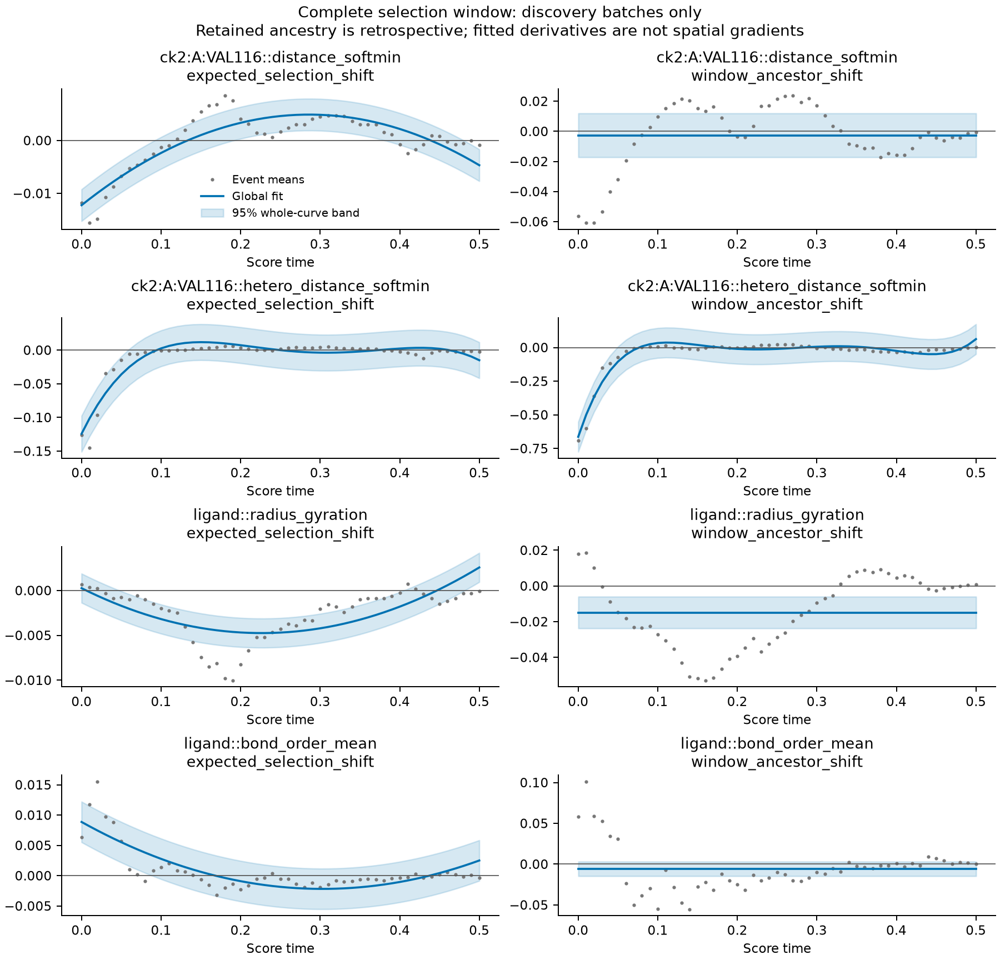
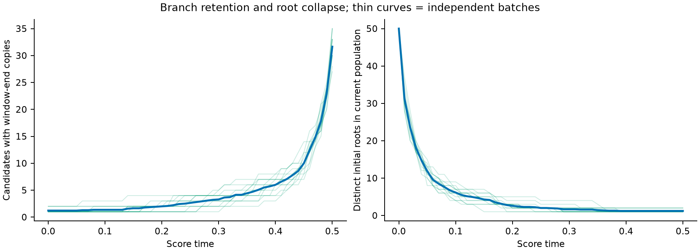

# CK2 单目标：完整 0–0.5 选择窗口的连续分析

本次已把主分析改为使用 51 个实际选择节点进行统一趋势、双侧富集、差异、PCA 和谱系分解；没有 0.1 宽子区间的统计或拟合。新增原子、形式电荷、化学键及区域三维位置特征。完整数据已在本地与远端各运行一次；发现集 14 批，验证和留出各 3 批，每批 50 个候选。

原数据仍为历史 `main1000_w050` 的 single 与匹配 unguided，共 40 份轨迹。仅提取预测终点和被复制的 proposal，得到 204,000 行、424 个特征。窗口末端留存标签只回溯到最后一次实际选择，不使用 t=1 结果。`window_end_copies=0` 是窗口内灭绝分支，不是分子构建失败。

## 分析实际改变了什么

- 每个原始时刻的候选分布、期望/实际复制偏移、随机差异、双侧富集、同父对照均保留。正式推断以独立批次为单位，整个窗口统一检验。
- 新增从 t=.5 最后一次选择向前回溯的后代拷贝数，分别考察祖先拷贝加权均值和留存/灭绝二组差异；没有把克隆计作独立重复。
- 相邻时刻的总体特征变化分解为选择复制和父子传递两个分量，并验证代数恒等式。原始变化率只使用两时刻均有观测的同一批次。
- 在整个时间轴上比较 0–5 次全局多项式；按批次留一交叉验证和 one-standard-error 规则选择次数，保存函数系数、解析一二阶导数、驻点、条件置信带及拟合残差。
- 验证/留出只评价冻结的发现集函数，不重新选次数或系数。常数模型和不充分数据均保留；没有要求每个特征必须有变化规律。

方法与输入输出接口见 [continuous_analysis_v3.md](continuous_analysis_v3.md)。

## 留下来的 seed 具有哪些特征

下表是预测终点的选择关联。均值按实际时间间隔做归一化全窗积分；q 是跨整条曲线、按 representation/arm/contrast 分族校正的函数检验，不是每个时刻的显著性。

| 特征 | 即时期望选择偏移 | 窗口留存−灭绝差异 | 解释 |
|---|---:|---:|---|
| ASN117 的 N/O/S 条件距离 | −0.008521 Å，q=.00225 | −0.042659 Å，q=.01478 | 异原子集合相对该区域的位置值得优先研究 |
| VAL116 的 N/O/S 条件距离 | −0.007302 Å，q=.00225 | −0.038362 Å，q=.01478 | 与邻近区域共同出现，不能视作独立可叠加机制 |
| ASN117 接触加权异原子比例 | +0.002090，q=.00225 | +0.011419，q=.63994 | 有即时组成偏好，但累计留存支持不足 |
| 配体平均名义键级 | +0.000666，q=.00225 | −0.004259，q=.21671 | 原始键标签的选择关联，不能解释为键能或稳定化 |

更具体地，ASN117 N/O/S 距离的候选均值在 t=0 为 7.310157 Å，而回溯得到的窗口祖先均值为 6.485676 Å；到 t=.5，二者约为 6.285067 与 6.284060 Å。其明显差异集中在起始候选及随后的连续衰减，而不是持续保持同样幅度的“优势区域吸引”。这只是回顾性的祖先特征，不能把约 0.82 Å 的早期差异直接设为干预位移。

**全原子接近与异原子位置必须分开。** ASN117 全原子距离的期望偏移全窗均值反而为 +0.001000 Å。VAL116 全原子距离虽有即时选择证据，但祖先拷贝加权偏移的全局 q=.317；N/O/S 条件距离的对应 q=.01294。新的结果不支持继续把“整片区域、全部原子统一拉近”作为主要解释。

**富集还反驳了简单的“越近越好”。** VAL116 N/O/S 距离的低端与高端概率质量偏移，全窗均值分别为 −0.004954 和 −0.004964，global q 分别为 .00235 和 .00220。阈值取自同一时刻的无引导背景四分位数；两端减少提示分布形状和中间范围也重要。均值负移不能替代完整分布分析，更不能自动转成无界的单向吸引。

预测终点共有 156 个即时均值偏移特征和 10 个祖先拷贝偏移特征通过 q<.05；高度相关特征不代表相同数量的机制。proposal 的对应均值偏移和留存差异没有通过这一阈值；其低端富集另有 7 项通过，需要按分布型证据单独核查。不能把 endpoint 规律直接当作已复制实际结构的规律。

## 连续变化能否用函数描述

可以，而且已经输出可调用函数。例如，VAL116 全原子距离的**期望选择偏移**被选为二次函数：

\[
\widehat{\Delta d}(t)=-0.0122389744+0.1197917910t-0.2093227582t^2,\quad 0\le t\le0.5.
\]

单位为 Å；其导数为 `0.1197917910 − 0.4186455165 t`，是选择偏好效应的时间变化率，不是原子速度或空间梯度。发现集均值曲线 R²=.757，批次留一误差比常数模型降低约 28.4%。该函数是整个窗口的一次拟合，驻点约 .286 并没有被当作新的分析区间。

N/O/S 距离的早期衰减更陡，因此部分曲线选择四次/五次多项式。独立数据上，冻结函数的平均 RMSE 如下，括号内是发现集常数基线：

| 特征与对比 | 验证集 3 批 | 留出集 3 批 |
|---|---:|---:|
| ASN117 N/O/S，即时期望偏移 | .04159（.05872）Å | .02575（.03482）Å |
| VAL116 N/O/S，即时期望偏移 | .03497（.05017）Å | .02319（.03001）Å |
| VAL116 N/O/S，祖先拷贝偏移 | .15389（.23508）Å | .10970（.14827）Å |
| VAL116 全原子，即时期望偏移 | .00704（.00910）Å | .00611（.00791）Å |

这支持它们作为比常数更有信息的描述；每个独立复核 split 仅三批，未据此增加新的显著性声明。

**局部形状仍可能拟合错误。** ASN117 N/O/S 在 t=.30 的观测即时偏移为 +.004946 Å，四次拟合为 −.004841 Å；回转半径在 t=.5 的观测偏移为 −.0000649 Å，二次拟合为 +.002568 Å。后者的条件带甚至不包含真实均值，说明这种带没有涵盖函数近似偏差。高 R²、全局 q 或驻点都不能保证每个时刻的方向正确。

已加入独立 `audit_function_adequacy.py`，逐函数保存反号节点数、最大残差、条件带外的观测均值节点数。它不重新拟合，也不把这些描述性诊断当作额外假设检验。`evaluate_continuous_function.py` 提供函数值与一二阶时间导数接口，禁止窗口外外推。

## 分支过程暴露的限制

发现集中，每批最初 50 个根谱系，到 t=.5 平均仅剩 **1.2143 个**。但此时当前选择概率的 ESS 仍约 **48.43**：权重接近均匀，不表示仍有 48 个独立祖先。回看 t=0，窗口祖先拷贝的 ESS 约为 1.0843。大量晚期分支是少量初始根的后代，不能被解释为大量独立进化实验。

同父 endpoint 对照约为数值零，例如 ASN117 N/O/S 距离最大事件均值绝对值约 6.44×10⁻¹⁷ Å，覆盖 50 个有同胞数据的时刻。因此仍缺乏“同一父节点中，某个局部变化导致下一步优势”的可识别证据。完整谱系提供的是选择关联，未来若要学可干预规则，仍需要反事实或时间滞后的比较。

## 能量与规则设计

新增特征包含接触区域三维偏移、原子类别、形式电荷、键级/键长及几何重叠代理。现有轨迹没有可信的逐区域物理能量；形式电荷不是部分电荷，pIC50 不是自由能，Ų 重叠量也不是 kcal/mol。原始 label=4 为零不能推断分子没有芳香性，解码/化学感知尚未包含在这个类别计数中。

下一轮规则更值得围绕**区域×原子类型×连续时间的有界分布目标**提出，并结合低/高端富集限制两端；避免继续使用固定子区间的全原子吸引。上述 f(t) 只描述特征及偏好变化，不能唯一确定 R(x,t)。只有在空间可微特征、函数形状充分性、幅度和独立干预效果均明确后，才能将其作为梯度奖励候选。

Analyst 已按新 continuous-3.0 skill 完成 subagent 模拟和 schema/语义校验。其输入包含完整时间曲线、根/ESS、同胞、淘汰及随机复制对照；没有给它验证/留出数据来选择规则。最终保留两项关联假说，暂缓四项规则，没有将多项式振荡编译成生成控制。

## 交付与复核

本地结果：`results/continuous_single_v3/`。远端结果：`/root/private_data/MolSteer/EvoMolSteer/results/continuous_single_v3/`。原始轨迹不变；约 730 MB 的本次特征缓存在成功后回收，可从原数据按校验值重建。正式曲线、系数、批次统计、失败拟合和窗口灭绝分支保留。

代码先从本地推送，再由远端拉取：完整分析版本 `a4c7d6e`；配对变化率、控制证据、拟合充分性与打包复核版本 `100990d`。新增冻结函数求值接口在后续提交中保存，不改变本轮系数。

58 项测试通过；本地和远端均通过 51,000 行候选谱系及 10,964 个函数的结构审计。51,000 行中保留 46,279 个窗口末端拷贝为零的候选记录，它们跨时间相关，不是独立失败样本。

远端压缩包已下载至 `data/analysis_continuous_v3_remote.tar.gz`，220,365,390 字节，SHA256 `ba51f423cf8d9d64301ced6521eeecbae3f5687ebea465f1910f27c271fa6988`；155 个包内文件校验全部通过。解包副本为 `data/continuous_remote_v3/continuous_single_v3/`。

104 张主要结果表的跨主机数值比较全部通过（rtol=10⁻⁷，atol=10⁻⁹），标签、形状和缺失值同时核对；实际最大绝对差异约 2.37×10⁻¹¹。Parquet 编码和部分浮点数允许平台差异，不宣称文件逐字节相同。记录在 `results/continuous_single_v3/cross_host_numeric_comparison.json`；小型证据与图另保存在本报告旁的 `experiments/continuous_single_v3_20261005/`。
