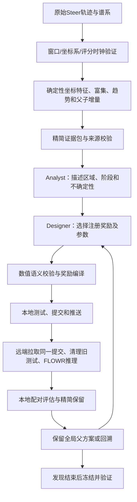

# 新30轮：逐轮改进依据、Steer数据挖掘、Agent工作流与最终奖励

依据：源码提交 `2474ea620524b02eb3872f3eb80547d4cafa6ac7`、本目录30轮配置/计划/推理报告/结果、实际Agent响应及最终冻结验证。本文是既有实验的审计与解释，没有追加推理、修改奖励或重新选择赢家。逐轮完整提交号、程序/参考库校验值、数值指标见同目录 `30_rounds_evidence_index.json`。

**当前冻结方案是第26轮：逐节点完整endpoint三维点云混合奖励，真实FLOWR坐标VJP，物理剂量比0.33。** 第27–30轮保持此奖励及参考库不变，使用新批次验证。因此准确的实验构成是26轮自适应探索、4轮冻结检查，而不是30个独立的新奖励，也不是30次独立LLM设计。

冻结后的400个配对尝试，预测CK2 pIC50均值比无引导提高0.173820，8个批次全部为正。最高预测亲和力没有全面超过无引导或历史Steer；应变优于无引导，但仍高于历史Steer。本次支持“坐标先验引导能够改善平均预测亲和力”，尚未完成“同时达到Steer能量稳定性”的目标。

**一、逐轮到底改变了什么，为什么改变**

下表Δ是最终生成分子的全部尝试预测pIC50均值相对于配对无引导的差值，不是百分比，也不是单个最高值。第1–26轮反复使用发现批次0/1，每轮引导100个尝试；选择具有自适应性，不能作为独立验证。第27–30轮各100个引导尝试及100个配对native。主种子42，批次编号区分随机流。所有实验完整运行100步，学习/控制窗口为动态配置的0–0.5，窗口外原生继续到1；没有SMC、分支复制或化学图接受/拒绝gate。

|轮次|实际改动|设计依据与要检验的问题|Δ pIC50|实测解释|
|---:|---|---|---:|---|
|1|沿用旧联合motif奖励，η从历史0.05提高到0.30|先检验之前差异小是否与实际注入剂量有关，避免仅改变奖励整体倍数|+0.016488|均值变化小；不能仅凭这一均值断定梯度没有生效|
|2|同一奖励η=0.51|一次改变强度，检查剂量响应|+0.053348|达到注册的明显收益阈值0.05，可以保留父方案并观察次级能量|
|3|同一奖励η=0.867|继续测试较强剂量是否增加收益|+0.061806|有所增加，但幅度有限，提示目标表达也需要改进|
|4|改为实际proposal坐标的高/低分几何目标，块权重[0.25,1,1,2]|检验质心、形状、距离核和受体位置是否比旧motif更合适|+0.030307|低于第3轮；换特征并未自动带来优势；此时还不是真实FLOWR endpoint反传路径|
|5|改为endpoint_direction，η=0.30，真实FLOWR VJP，块权重[0,1,2,1]|FLOWR预测endpoint，把几何标量作用于预测endpoint，再通过生成模型传回当前坐标|+0.059752|获得收益；开始复用每步原生forward，无亲和力head梯度|
|6|稀疏endpoint_direction：只用24个支持字段；拒绝不符合节点数据的拟合曲线|排除尺度下限、微弱效应与方向不稳定字段；防止窗口平均方向被错误外推到每一节点|−0.006339|实际控制已生效而最终收益消失，说明统计支持不等同于可用空间控制方向|
|7|完整endpoint_pointcloud；K=4、β=2、T=4 Ų、τ=0.5、δ=1 Å、η=0.30|保存原子坐标的联合关系和多个真实构象模式，避免独立特征均值形成不存在的折中构象|+0.229293|本轮主要突破；收益显著大于线性/压缩方向奖励，成为后续主要父方案|
|8|在第6轮稀疏方向上采用逐节点node_contrast|检验实测局部高低分方向是否优于整个窗口的平滑效应方向|−0.009526|未恢复收益；不能把失败仅归咎于平滑曲线|
|9|支持字段空间内的稳健prototype吸引；history_strength=0，η=0.30|用具有有限最大值的吸引奖励替代可持续外推的线性判别，保留多prototype|−0.041429|方向/表示仍不足；不能因函数更稳定就声称更有效|
|10|回到第7轮完整点云，η=0.51|在已有正确方向上检验更强剂量|+0.206789|仍有收益但低于第7轮；强度不呈单调关系|
|11|第9轮加入父子endpoint特征增量项，history_strength=0.25，时间幂2|检验优势分支的变化方向能否帮助优势持续到终态；只允许1个有统计支持的增量字段|−0.039052|略高于第9轮但仍为负；该历史项未解决目标不足，保留第7轮|
|12|第7轮完整点云η=0.867|进一步测试强注入是否越过有利控制范围|+0.139001|收益进一步下降；不支持继续无条件加大剂量|
|13|完整点云加入region0空间注意力，半径5 Å，背景权重0.25|根据富集定位VAL53附近的坐标区域，强调它，同时保持周围区域参与整体现实构象匹配|+0.212839|有效但未超过第7轮；局部聚焦不是当前主要瓶颈|
|14|第7轮β从2升至6|检验离线teacher评分更强地参与条件先验是否更好|+0.194623|过度强调评分未增加平均收益|
|15|第13轮扩展至20个有支持的区域，按支持效应强度赋权|检验多区域协同关注是否比单区域更有效|+0.203369|未超过全局点云；重叠Gaussian区域不是20个独立因果motif|
|16|第7轮K=1、T=1 Ų|检验更尖锐的单teacher吸引，减少模式混合|+0.103399|明显下降；K=1时归一化先验只有一个元素，β/T/τ对混合选择不再生效，不能把结果单独归因于T|
|17|换成终端后代信用的存活祖先endpoint库，η=0.30、β=2；每批仍最多2个teacher|从“当前高分”转向“其后代最后仍有优势”，检验长期信用|+0.160317|低于第7轮；MMFF p90=2.0141也变差。改动同时涉及资格、teacher身份和基础权重，不能只归因于后代信用|
|18|第7轮K=8、T=16 Ų|检验更多、更宽的邻近构象模式是否增加自由度和兼容性|+0.166963|未超过K=4/T=4；这是联合参数改动，不能分离两者贡献|
|19|第17轮祖先库β=0|保留存活祖先几何，取消条件先验的离线分数偏好，检查幸存者库中重复强调评分的影响|+0.229364|恢复接近第7轮的平均收益；发现集最高有效pIC50=8.558043。仍有存活资格偏差，不是完全无选择偏差|
|20|第7轮η=0.195|检验较弱的正确几何方向是否足够|+0.110902|收益明显降低，说明此目标下剂量过小也会损失收益|
|21|第7轮原始瞬时高分库β=0|与第19轮区分：离线分数偏好在另一teacher库里是否有益|+0.214475|略低于β=2；评分权重作用依赖teacher库，不能普遍要求β=0|
|22|第13轮区域注意力加入逐节点abs(effect)显著度幅度，截断[0.1,2]|把实测时间变化加入区域强调，但绝对值只控制幅度，不把它误作方向|+0.213974|比第13轮仅多0.001135；中间形状改善约23.51%，仍未换来最高平均亲和力|
|23|第7轮η=0.375|在0.30附近较细地测试增强|+0.181366|不如0.30；继续保留全局父方案|
|24|第17轮祖先库η=0.18，β=2|排查祖先库退化是否可通过降低强度改善|+0.081101|亲和力收益下降且应变p90=2.3865；小剂量没有修复不合适目标。实际不是regional默认表中的T=0.5实验|
|25|第7轮η=0.24|在0.30附近较细地测试减弱|+0.178389|不如0.30；说明简单减弱不够|
|26|第7轮η=0.33，其余有效参数不变|对正确几何目标进行小幅强度细化；在接近的亲和力方案中观察能量尾部|+0.230299|冻结赢家；与第7轮亲和力差只有0.001006，主要结合次级应变选择，不是新的亲和力突破|
|27|第26轮函数/参考库冻结；新批次20/21，另做完整zero/native检查|检验重复发现批次之外的效果及零强度路径一致性|+0.116303|新批次仍有收益，禁止据此重新调参|
|28|同一冻结方案，新批次22/23|独立留出随机批次检查|+0.148553|保持正收益，没有新增奖励|
|29|同一冻结方案，新批次24/25|再检查随机批次波动|+0.143465|保持正收益，没有新增奖励|
|30|同一冻结方案，新批次26/27|完成预定冻结验证预算|+0.286960|保持正收益；本地评估内存错误后对相同样本降低并发重算，没有追加生成或换样本|

每轮都有独立推理提交与不可变程序。第7轮推理提交为 `7bbc873a`，第17轮为 `a09eadb3`，第26轮为 `9a6f80a0`。不是每轮都增加一种新源码算法：很多轮只改变已注册参数并保存配置，实际提交号及所有参数由证据索引给出。

**选择第26轮的实际规则。** `generation/affinity_campaign.py::select_parent` 首先要求预测覆盖率≥0.99、有效率相对下降不超过0.10、亲和力差有限；按平均亲和力差选父方案。启用次级能量后，只有最佳差≥0.05，才在距离最佳差不超过0.01 pIC50的方案里，以应变中位数和p90相对改善中较弱的一项排序。此规则避免用某一个能量指标的改善遮蔽尾部变差。第26轮应变中位数/重原子0.476946、p90=0.954550、有效99/100；第19轮中位数0.500959、p90=1.012100、有效96/100。第19轮最高单体评分更高，但当前主目标和注册选择规则不是最高单体评分。

**二、代码改进可以归为六条技术线**

|技术线|新增/优化的核心模块|对应轮次|目前得到的结论|
|---|---|---|---|
|实际剂量而非奖励整体倍数|`generation/coordinate_reward.py`、`local_reward.py`、`affinity_campaign.py`|1–3、10、12、20、23、25、26|归一化抵消奖励整体正数缩放；应改变η并测量实际Å位移；收益对η不单调|
|FLOWR endpoint反传|`generation/endpoint_controller.py`、`endpoint_reward.py`；入口`generate_affinity_endpoint_flowr.py`|5起|真实生成模型Jacobian可以把预测endpoint的几何目标作用到当前噪声坐标，无额外每步forward/head推理|
|坐标统计与曲线可信度|`continuous/affinity_endpoint.py`、`sparse_design.py`、`generation/sparse_reward.py`|6、8|筛选统计字段和纠正时间曲线是必要的证据约束，但不足以形成有效方向奖励|
|完整构象与压缩信息比较|`generation/affinity_geometry_reward.py`、`persistent_reward.py`、`continuous/endpoint_kinematics.py`|7、9、11、14、16、18、21|完整点云实验更好；信息审计不支持把这一差异说成已经证明的因果压缩损失|
|局部区域与动态强调|`continuous/endpoint_regions.py`、`regional_design.py`、`generation/regional_point_reward.py`、`regional_campaign.py`|13、15、22|能够定位可复核区域并输出实际节点函数，但局部加权未胜过完整全局构象目标|
|谱系信用、回溯和冻结验证|`continuous/terminal_lineage.py`、`terminal_design.py`、`generation/terminal_campaign.py`、`scripts/resume_affinity_campaign.py`|17、19、24、27–30|早期谱系坍缩限制信用学习；下降时保留赢家，结束发现阶段后用新批次验证，避免覆盖最优方案|

**三、当前Skills与workflow怎样约束Agent**

工作流是确定性计算证据、Agent解释和设计、受约束编译、真实模型验证的组合。LLM没有逐原子凭空计算统计量，也没有训练新的亲和力网络。完整三维库在运行时由数值程序读取；Agent读取精简表、节点函数、单位、评分/失败对照、谱系支持度与库的来源约束。

最相关的Skill文件及实际职责：

|Skill|给Agent的实质指令|如何核实实际响应|
|---|---|---|
|`skills/affinity-endpoint-pullback/SKILL.md`|用实际FLOWR endpoint VJP；detach亲和力输出和self-conditioning；复用原生forward；覆盖全部学习节点；窗口外原生继续|literal响应记录梯度路径与调用预算，实际GPU有限差分和完整zero/native路径校验|
|`skills/affinity-sparse-coordinate/SKILL.md`|看p/q、CI、方向一致性、尺度下限；不能随意分时间箱；不合格拟合不得用于控制；时间导数不是空间梯度|响应复制24字段支持、实测节点函数及曲线不合格信息，由语义验证器检查|
|`skills/affinity-persistent-coordinate/SKILL.md`|结合第6轮实际已生效但终态失败的反证；只允许1个有支持的父子增量字段；先测试history=0，再测试历史项|绑定当前prior/参考库，要求具体数值反证；不能把24个位置字段全部宣称为显著速度|
|`skills/affinity-regional-pointcloud/SKILL.md`|优先三维坐标；每父节点/批次去重复；窗口平均效应不等于恒定方向；保留完整点云和区域外正背景权重；承认区域重叠|实际响应选region0，报告0.639235、首尾负值、43正/7负节点，明确禁止恒定有符号吸引|
|`skills/affinity-terminal-lineage/SKILL.md`|正确反向追踪谱系；灭绝信用为空；早期祖先不足不能填高低组；存活不等于亲和力因果性；等批次再等祖先，不能按克隆数量奖励|实际响应报告349/700、531/700、初始存活祖先中位数1、400项无显著结果，并保留第7轮父方案|

初始直接坐标Skill和后来endpoint Skill属于不同控制配置。当前终端扩展工作流显式检查terminal与regional的当前Skill、input、prompt、literal response和源码哈希；不是无条件把所有历史Skill拼接到同一system prompt。较新的自包含profile规定真实FLOWR VJP，因此不能把初始直接坐标版本的旧描述当成当前路径。

实际证据与响应位于 `endpoint_skill_test/`、`sparse_skill_test_v2/`、`persistent_skill_test/`、`regional_skill_test/`、`terminal_skill_test_v4/` 和 `post_round17_skill_response/`。后者在第17轮退化后仍明确选择第7轮为全局父方案，并把后代信用问题作为反证继续分析。

通用接口 `src/evomolsteer/agents.py` 提供export/import以及OpenAI兼容HTTP接口，Skill进入system消息，prompt与证据进入user消息，要求JSON schema。连续窗口分析不能错误进入旧的分阶段Designer编译器。本次按此前要求使用实际subagent模拟LLM接口，保留原始响应；专用坐标工作流随后做注册公式编译和逐轮参数搜索，并不是每轮都重新调用网络LLM。

验证包含两层：文件内容/来源一致性，以及响应是否遵从具体指令。哈希正确但把灭绝写成0、把末次latent评分冒充最终解码评分、填补稀疏祖先组、把每批teacher上限改成10、给予克隆数先验奖励、宣称存活有因果性、采用错误批次基础权重、添加每步head调用或使用单位Jacobian等9类行为错误，均由反例测试拒绝。独立Skill复核截至第28轮；第29–30轮属于冻结重复，30轮运行与保留一致性另由`completion_audit.json`验证。不能把这解释为已经证明LLM/Skill带来了因果收益，后者需要工作流消融。

**四、具体分析哪些Steer数据**

输入为14个原始single-target Steer批次，每批50个候选槽位。按实际重采样标志和两个时钟筛选：评分时间`t≥window_start`，对应proposal状态时间`s≤window_end`。本次`t=0,0.01,…,0.49`，`s=0.01,…,0.50`，共50个实际选择事件、35,000个候选槽位×事件记录。它们不是35,000个独立观测；统计独立单位是14个生成批次。

控制窗口0–0.5动态来自数据参考与程序。本次边界采用状态时间≤0.5，所以评分t=0.5但proposal状态0.51的记录不能作为窗口内几何。末端未来选择可以作为谱系离线标签，但不会把窗口外几何放入奖励。

重要数据包括`proposal_coords`（带噪实际状态）、`predicted_coords`（FLOWR当步预测endpoint）、`pic50_on`、`selected_indices`、`resampled`、`score_time`、`state_time`、`mask`和坐标恢复的scale/COM。三维世界坐标为归一化坐标×scale+目标COM；所有目标和匹配保持受体坐标系，不对配体独立旋转对齐。

当前主要富集对照是同一事件内评分上/下四分位的候选，而不是把“高分”直接等同于“最终成功”。高分组和低分组反映Steer的选择偏好；原始teacher库从高评分候选提取完整endpoint，每批最多2个不同几何teacher，不能保证每个teacher最终存活。真正“留下来的祖先”由另一条terminal谱系分析处理。这一区分防止把即时评分关联误报为长期成功规律。

**五、富集与差异分析的数学定义及结果**

1. **全局74项纯坐标特征。** 质心3项、协方差6项、5个原子对距离Gaussian核、20个受体landmark各3项。landmark从参考配体8 Å内受体重原子中选取，先取最接近配体质心的点，再用最远点覆盖；它们不是预先认定的作用残基。原子对核中心为1.5/2.5/3.5/5/7 Å、宽0.75 Å；landmark字段为softmin距离和3/5 Å径向Gaussian壳层占据率。后两者不是硬接触计数或半径内原子数。

对于特征f、批次b和节点t，令高/低分均值为μH、μL，尺度为全窗口平均方差积分的平方根，并设置下限。定义

\[
e_{bf}(t)=\frac{\mu^H_{bf}(t)-\mu^L_{bf}(t)}{s_f},\qquad
E_{bf}=\frac{1}{t_L-t_0}\int_{t_0}^{t_L}e_{bf}(t)\,dt.
\]

对14个`E_bf`做批次t检验、2000次批次bootstrap置信区间和BH校正，并计算方向一致性与同节点评分Spearman关联。不把时间点或被复制的候选当作独立n。初始全局74项计算在批次内未额外按父节点去权，后续regional/增量模块增加了这一修订。

实际proposal表示74项**0项q<0.05**；endpoint表示74项**47项q<0.05**，最小q=1.49366×10⁻⁵。但有14项落到尺度下限；最终稀疏支持规则为q<0.05、|E|≥0.1、方向一致≥12/14批、排除尺度下限，留下24项。47不能解释成47个可靠因果位点。

部分endpoint结果如下，末列是高低差异曲线最后节点减首节点，不是坐标梯度：

|坐标特征|窗口平均标准化高低差|q|同方向批次|最后减最初差异z|
|---|---:|---:|---:|---:|
|shape_yy|−0.512823|0.00001494|14/14负|+0.148427|
|pair_kernel_2.5|+0.630662|0.00002189|14/14正|+0.082410|
|pair_kernel_3.5|+0.539714|0.00009751|14/14正|+0.282176|
|pair_kernel_1.5|+0.561944|0.00014586|14/14正|−0.099084|
|pair_kernel_7.0|−0.485400|0.00014586|14/14负|−0.015470|
|VAL53/landmark00，3 Å壳层占据|+0.544904|0.00023522|14/14正|+0.234476|
|VAL53/landmark00，softmin距离|−0.480564|0.00081275|14/14负|−0.449551|

这些关联提出“优势endpoint具有不同的短/长距离分布、各向异性形状和受体相对位置”的假设，不能由纯坐标字段推断氢键、元素特异作用或结合能改善。shape_yy依赖固定受体坐标轴。评分由联合坐标/原子/键latent head产生，endpoint关联也不是独立几何亲和力预测器。

2. **区域200项特征。** 对20个landmark分别计算Gaussian软质量1项、局部质心偏移3项、局部协方差6项，半径尺度5 Å：

\[
w_{ir}=\exp\!\left(-\frac{\|Y_i-p_r\|^2}{2\ell^2}\right),\quad
m_r=\frac1N\sum_iw_{ir},\quad
\mu_r=\frac{\sum_iw_{ir}(Y_i-p_r)}{\sum_iw_{ir}}.
\]

每个父节点内先平均同一分数组的孩子，再等权平均父节点，然后等权批次。这样降低克隆重复的权重，但仍是选择条件下的观察性关联。每个字段预先定义三个指标：全窗口平均富集；`(e_last-e_first)/(t_last-t_first)`；所有已观察父子增量高低差之和除以窗口时长。所有200×3=600项一起BH，不是按区域分别挑显著。

600项中，平均富集69项q<0.05、变化率22项、父子增量对比率21项。再要求效应大小和≥12/14批方向一致，平均富集保留63个字段，分布于20个重叠区域。重叠、协方差和全局形状使这些区域相关，不能把20个区域计作20次独立发现。

最强可复现正soft_mass为region0，即受体A链VAL53的CG1附近 `[26.351,-30.381,16.189] Å`；不是历史监测用ASN117/VAL116区域。其平均效应+0.639235 z，95%CI [0.492460,0.790651]，q=0.000187945，14/14批为正。其他满足正soft_mass与一致性筛选的区域是MET163附近region7（+0.480601，q=0.007393，12/14正）和ASN161附近region10（+0.395255，q=0.000372，14/14正）。

region0的50节点均值有43正、7负；t=0为−0.365951，t=0.16为+1.640798，t=0.49为−0.275338。窗口中间富集并不意味着首尾同方向，不能写成全程向VAL53吸引。R13改为在完整构象匹配中强调该区域，R22进一步用|e(t)|调节强调幅度。两者均未超过全局点云，提示周围构象关系也有价值；尚未证明优势原因就是某一残基作用。

3. **父子增量。** 用`selected_indices`连接相邻事件的父endpoint与子endpoint，计算标准化特征差；先按父节点去重复，再比较高低分子代。整个窗口累加实际观察的边增量，不能把第一个无观察占位或梯形端点半权重混入边总量。74项中只有landmark00_softmin满足全部历史支持要求：对比变化率−4.914370 z/单位t，95%CI [−6.854886,−2.615735]，q=0.046083，13/14负。它是预测特征增量，不是同一原子的真实物理速度。R11加入该信息仍未取得正最终收益。

**六、趋势能不能拟合成函数**

可以拟合，但需要区分统计描述函数与用于控制的空间标量。

当前全窗口拟合把`t∈[0,0.49]`映射到`u∈[-1,1]`，采用Legendre基底：

\[
\hat e_f(t)=\sum_{k=0}^d a_{fk}P_k\!\left(2\frac{t-t_0}{t_L-t_0}-1\right).
\]

以积分权重做每批拟合，通过留一批次交叉验证预测被留出批次的整条曲线，按one-standard-error规则选最简单的可接受阶数。全局proposal74项全选0阶；endpoint74项中65个0阶、8个2阶、1个1阶。例如`pair_kernel_2.5`的2阶系数为 `[0.63096686,-0.36829616,-0.73148035]`，而`pair_kernel_7.0`的1阶系数为 `[-0.48540019,0.35176723]`。没有任意划分0–0.1等区间。

保守模型描述批次间的平均曲线，不保证每一节点的符号正确。稀疏控制另有节点可信度审计：相对节点RMSE≤0.35、强符号冲突数=0、静默节点中过大拟合比例≤0.1。24个候选字段没有一项通过全部运行时拟合要求；因此第6轮采用实际节点函数，而不是强行使用多项式。区域模块保存实际50节点的均值和数值时间导数，并允许分段线性插值。`de/dt`是群体差异变化率，不能直接当作`∇_x R`；后者必须由可微坐标观测函数构造后求导。

最终赢家不使用这些多项式作为主奖励。它用50组阶段特定的真实teacher点云，在同一已学习时间节点构造空间奖励。因此最终函数是时间条件化的完整构象目标，不是一个固定形状模板，也不是拟合出来的额外神经网络。

补充的信息审计在排除相同teacher批次后，对比压缩字段选择与完整坐标选择：压缩选择相对完整选择的固定框架RMS多0.080974 Å，但这一“额外距离非负”由比较定义保证；选择teacher的评分关联，压缩表示为0.101826、完整表示为0.064078。不能声称完整表示在这一审计中具有更高评分关联，更不能仅据此解释第7轮的亲和力改善。运行时奖励还包含评分先验、模式混合与FLOWR Jacobian，这个审计没有同时消融它们。

**七、真正的存活分支给出了什么信息**

`terminal_lineage.py`正确反向追踪`selected_indices`：row j的选择把下一row的孩子映射至本row父节点；末row99评分是选择前的joint latent head，t=0.99，对应状态时间1.0，不能再把row99的选择倒算到自身。

每个窗口内祖先的后代计数由终端槽位反向汇总；有后代时未来信用为其最后记录评分的平均，无后代时信用为空而不是0。未来选择可进入离线标签，奖励几何只使用0–0.5窗口。基础先验先等批次，再等祖先，不按后代克隆数量加分。

结果有明显早期坍缩：700个批次×节点中349个少于3个存活祖先，531个少于6个，最初节点存活祖先中位数1。不能补出整个窗口的终端亲和力高低组。允许的200字段×2个存活描述指标做联合BH，共400项**0项q<0.05**；平均存活富集最小q=0.120427，变化率最小q=0.301899。

祖先teacher库每批上限2，固定受体框架Hungarian RMS<0.001 Å的近拷贝去重复，早期17个teacher逐渐恢复到28个；原始第7轮每节点28个。R17/19/24研究的是存活祖先点云库及条件评分/剂量，不是有显著终端motif支持的奖励。R17收益降低；R19取消条件分数加权后接近第7轮；R24降低剂量并未解决能量问题。最终第26轮回到原始瞬时高分库，不能说它已经采用最终成功后代作为全部teacher标签。

**八、当前奖励及其梯度的精确形式**

当前配置 `configs/experiments/ck2_affinity_geometry30_v1/backtrack_round26.json`，实际实现为 `EndpointGeometryReward → AffinityGeometryReward`。参考库为 `endpoint_reference.json.gz`，SHA256 `d706173b74a937c5becac08ccbcff187f48e50ca3303d9021667e466fa5fb77c`，压缩后2,294,648 bytes，50节点、每节点28个完整endpoint teacher。没有新拟合模型。

设当前归一化坐标为x_t，FLOWR已经需要计算的世界坐标endpoint预测为Y=Fθ(x_t,t,pocket,detached self-conditioning)。先对`A=stopgrad(Y)`与该t节点的每个teacher T_k做不依赖类型/化学图的Hungarian三维平方距离匹配σ_k：

\[
C_k=\frac1N\sum_i\|A_i-T_{k,\sigma_k(i)}\|^2.
\]

按C选最近K=4个teacher，以离线已保存分数s_k和距离构造条件先验：

\[
\pi_k=\operatorname{softmax}_k\left[-\frac{C_k}{4}+2(s_k-\bar s)\right].
\]

匹配、teacher选择及π在这次梯度中冻结。当前原始库没有终端等批次祖先额外log权重；终端实验库另加`−log(该批选入teacher数)`。新分子不需要具有teacher相同化学图或相同原子类型，当前实现使用固定活动原子槽位。

在可微Y上重新计算每个已匹配teacher的均方距离和稳健代价：

\[
q_k(Y)=\frac1N\sum_i\|Y_i-T_{k,\sigma_k(i)}\|^2,
\quad \rho(q)=\delta^2\left(\sqrt{1+q/\delta^2}-1\right),\quad\delta=1\ \mathrm{Å}.
\]

最终标量为：

\[
\boxed{R_t(Y)=\tau\log\sum_{k=1}^{4}\pi_k\exp[-\rho(q_k(Y))/\tau],\qquad\tau=0.5.}
\]

这里保留多个真实构象模式，避免先把teacher坐标平均成一个折中目标。R≤0、有有限最大值，但并不是上下均有界。配置中遗留的`robust_delta=2`不是这个pointcloud公式的曲率；实际默认`pointcloud_delta_A=1`。同样，遗留`geometry_block_weights=[0,1,2,1]`不决定完整pointcloud的力权重，只用于兼容/监测。

令

\[
\alpha_k(Y)=\frac{\pi_k e^{-\rho(q_k)/\tau}}{\sum_j\pi_j e^{-\rho(q_j)/\tau}}.
\]

冻结对应关系与先验时，空间梯度为：

\[
\nabla_{Y_i}R_t=-\sum_k\alpha_k\,
\frac{Y_i-T_{k,\sigma_k(i)}}{N\sqrt{1+q_k/\delta^2}},
\quad
\boxed{g_t=\nabla_{x_t}R_t=J_{F_\theta}(x_t)^\top\nabla_YR_t.}
\]

这里的Jacobian就是FLOWR真实endpoint预测对当前坐标的导数。模型参数冻结，坐标保留梯度；head输出detach且hook禁止奖励梯度进入亲和力分支。该导数不是重新选择Hungarian/teacher/先验的全导数，而是固定这些条件后的分段可微VJP。

**九、如何把reward gradient变成实际坐标引导**

线性endpoint参数化给出的确定性flow步长为：

\[
v_t\Delta t=\frac{F_\theta(x_t)-x_t}{1-t}\Delta t.
\]

当前剂量标尺为这个`predictive_flow`增量的每原子RMS；不是完整SDE随机步长。设坐标缩放为a、`rms(g)=sqrt(Σ_i||g_i||²/N)`，在未触及限制且梯度非退化时，归一化坐标中的注入为：

\[
u_t=\frac{\eta\,\mathrm{RMS}_{\mathrm{Å}}(v_t\Delta t)}{a\,\mathrm{rms}(g_t)}g_t,\qquad\eta=0.33.
\]

程序对原生Euler/SDE及离散原子/键更新之后的坐标加u_t。g是在更新前x_t计算的，属于滞后的注入；没有在更新后再forward校正。每原子位移上限0.15 Å、累计逐步RMS上限6 Å、严重新增受体碰撞阈值0.8 Å与最多7次回缩；这些是几何控制边界，不是限制化学图变化的gate。

所有50个学习节点的时间幅度均为1（`time_ramp_power=0`），每步均引导；窗结束停止并完成剩余推理。窗口从参考和配置读入，代码校验学习/作用范围一致。实际第26轮平均每步注入约0.014752 Å，累计逐步RMS约0.737603 Å；累计路径长度不是最终净位移。

因此“奖励乘10”一般会同时把g与其RMS乘10，在归一化中抵消；真正改变剂量要修改η、时间幅度或实际限幅。小的平均亲和力差也可能来自正负样本抵消，不能仅凭均值判定没有引导。必须看实际非零位移、有限差分、限幅/拒绝及配对分数绝对变化。

生产每步仍只有一次原生FLOWR forward，无额外每步亲和力head推理。反向传播与Hungarian匹配有计算开销，不能说引导没有成本。新梯度路径/目标的一次性有限差分通常额外4次forward，带历史项时8次，单独记录；完整zero/native生成校验是另一项检验，不能被有限差分替代。已保留16个批次的100步完整zero/native一致性证书。日志`g·u`是一阶估计，不是重新推理测得的注入后奖励增加。

**十、当前最优方案的独立结果与仍未达成的部分**

|指标|冻结引导400|配对无引导400|历史Steer100|
|---|---:|---:|---:|
|全部尝试预测pIC50均值|7.600273|7.426452|7.510351|
|有效分子预测均值|7.604906|7.426259|7.501144|
|有效分子最高预测pIC50|8.310325|8.544977|8.347940|
|去重Top5均值|8.134289|8.236794|8.138809|
|结构有效率|96.75%|93.75%|98.00%|
|MMFF松弛能差/重原子，中位数|0.510402|0.546064|0.398679|
|MMFF松弛能差/重原子，p90|1.017042|1.264307|0.535713|
|周围区域孤立松弛RMS，Å|0.279371|0.342276|0.202921|

全部8新批次均值提高，均值差+0.173820、批次bootstrap95%CI [0.113314,0.239207]，在批次独立/sign-symmetric零假设下精确signflip p=0.0078125；62%的配对样本提高，平均绝对配对评分变化0.440498。只看第28–30轮留出300个样本，平均差+0.192993、6批CI [0.131026,0.265349]。这些是同一口袋的新随机批次，不是新靶点泛化或实验结合测量。

历史Steer100来自已保留`candidate_metrics.csv`中`arm==single`的100条，另外100条unguided不混入。它不是全量原始Steer实验的已验证全局最优，也不是400个新样本的等预算配对对照。最高、Top5和均值必须分别报告。

应变是孤立配体在同一化学图上局部MMFF松弛的能差，单位为kcal/mol/重原子；不是结合自由能。失败与未收敛分母保留：冻结引导387个收敛，无引导375个。周围区域指标来自历史ASN117/VAL116监测区域，也不是完整受体适配性/蛋白松弛评价。PB_fast通过率96.5%对93.5%，不能冒充完整PoseBusters。

对原假设的证据边界：当前证明了完整窗口坐标先验可以通过真实模型梯度改变生成分布并提高平均预测亲和力；没有证明某个区域具有因果优势、LLM发现了额外超过确定性搜索的规律、不同化学图导致退化，或已经优于Steer的全部物理指标。第26轮0.5状态形状指标相对native改善约17.36%，第22轮约23.51%却未赢得亲和力，说明中间态相似度不是最终主目标的充分条件。

值得后续检验的缺口是：瞬时高分库与终态成功之间仍有信用差距；当前局部Gaussian矩不能完整表达方向性、多点几何关系与构象兼容性；窗口之后的原生延续可能放大/改变优势，但现有数据没有识别唯一退化机制；纯点云匹配没有显式键长/角/能量方向。这些可形成新的实验假设，不能把没有实现的项写成当前奖励。下一阶段应首先保留已验证的平均亲和力收益，再用独立消融检验局部关系与兼容性、teacher库和动态剂量，而不是因化学图改变添加gate。

**存储与复核。** 当前数值证据采用批次/节点矩、效应表、函数、评分/失败和小型teacher库。regional批次矩5,729,952 bytes、600效应表39,116 bytes、支持表4,889 bytes；terminal效应400行27,244 bytes。没有新增逐候选展开大缓存。生成测试结构和传输归档在报告校验后按轮退休，原始Steer与checkpoint保留。本文索引仅34 KB，逐轮完整来源和指标可复核；阶段汇总不能恢复原子明细，恢复依赖原始Steer、配置和代码。
