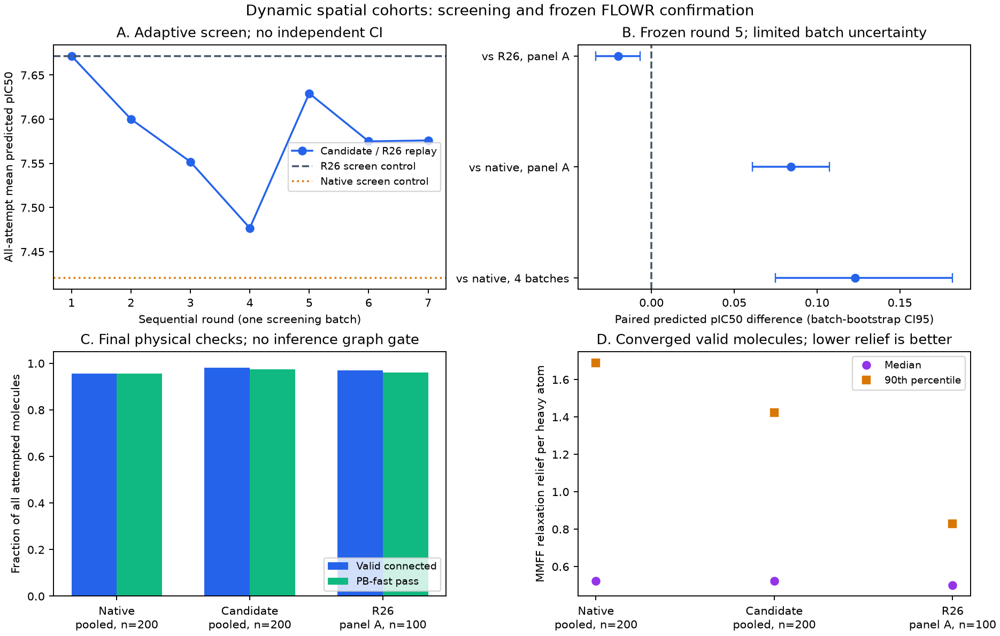

# 动态优质seed划分与空间对比：十轮探索结果

日期：2026-10-08。十轮均完成真实FLOWR推理，共900条生成尝试。起点为历史验证的R26；新方案中筛选最好的候选为第5轮：动态质量群体、空间难负例与较轻的区域对比奖励。

**结论：新增模块能够发现个别亲和力与构象质量同时改善的路径，但平均亲和力尚未超过R26，因此保留R26作为默认推荐。** 四个独立批次上，新候选相对无引导平均提高0.122962 pIC50，批次bootstrap区间[0.074926, 0.181836]，结构与应变总体接近或优于无引导；同批次相对R26仍低0.020122。不能将富集显著性或单个高分分子等同于整体优越性。

所有亲和力为FLOWR模型预测，不是实测。主seed为42，推理批次流为42+100003×batch；实验臂使用相同初始坐标、原子、键与随机流。模型为flowr_root_v2，100步，学习支持从输入声明读取，当前0–0.5引导、其余原生续推至1；没有Steer重采样、亲和力梯度或每步额外生产前向。化学图自由变化。

## 文献借鉴与实现选择

检索并核实了[FALCON（CVPR 2026）](https://openaccess.thecvf.com/content/CVPR2026/html/Kim_FALCON_False-Negative_Aware_Learning_of_Contrastive_Negatives_in_Vision-Language_Alignment_CVPR_2026_paper.html)、[ConR（ICLR 2024）](https://arxiv.org/abs/2309.06651)、[ACCon（AAAI 2025）](https://arxiv.org/html/2501.07045v1)、[Rank-N-Contrast（NeurIPS 2023）](https://proceedings.neurips.cc/paper_files/paper/2023/hash/39e9c5913c970e3e49c2df629daff636-Abstract-Conference.html)以及HCL和Debiased Contrastive Learning的论文/作者代码。借鉴动态比较关系、连续标签距离、困难对照与误负例保护；没有训练它们的编码器或采样策略网络，也不宣称论文性能已经迁移到分子任务。

本项目采用确定性、家族平衡的加权Otsu质量阈值，按事件IQR留模糊带。正例是当前节点较高在线评分，负例是明确较低的已观测评分；模糊样本单独记录，缺失未来不是失败。这个阈值算法是本项目工程选择，不是上述论文提出的分子算法。完整来源、实际读取的代码与迁移限制见[研究报告](../../research/dynamic_cohorts_20261008/report.zh-CN.md)。

## 全窗口挖掘结果

在14个Steer发现批次上分析0、0.01、…、0.49评分节点，其对应提议状态直到0.5。原始t=0.5选择的提议到0.51，超出学习支持，故不进入本轮知识；原始边界数据仍保护保留。没有划分0.1时间子区间。

使用预测终点的世界坐标，提取74项纯坐标字段。每个landmark有softmin距离、3Å与5Å高斯壳层密度；另有全局形状等诊断。家族内复制数影响权重，但独立统计单位是生成批次。保存全窗口效应、批次bootstrap区间、p/BH-q值、方向一致性、节点覆盖和函数。普通对照有695/700个可识别事件，缺失不填零。

| 初始合格字段 | 全窗口标准化正负差 | BH-q | 同方向批次 | 数据含义 |
|---|---:|---:|---:|---|
| L00 softmin | −0.460 | 0.003387 | 14/14 | 正例更接近该landmark |
| L00 3Å壳层 | +0.462 | 0.003387 | 14/14 | 正例该壳层密度较高 |
| L03 softmin | +0.383 | 0.018696 | 12/14 | 正例距离较大 |
| L03 3Å壳层 | −0.073 | 0.008829 | 12/14 | 小幅密度降低 |
| L03 5Å壳层 | −0.381 | 0.006405 | 12/14 | 该壳层密度较低 |
| L04 softmin | −0.251 | 0.046522 | 11/14 | 较弱的接近关联 |
| L12 3Å壳层 | −0.309 | 0.029521 | 11/14 | 该壳层密度较低 |

这些landmarks与输入受体的Val53 CG1、Asp120 OD1、Glu114 CD、Glu55 OE1坐标对应，但距离场不是已证实的化学作用或能量贡献。难负例控制质心/协方差后保留四个区域，多数差异减弱，增加L04的5Å壳层字段。全局形状也显著，是需要保留的混杂线索。

普通对照下，正例平均后代数1.142、对照0.744，86.76%的可识别事件正例后代期望更大；全窗口批次等权差0.397，区间[0.353,0.441]。它确认质量划分与实际分支偏好对应，不能作为独立亲和力收益。

**差值函数与目标轨迹必须分开。** 74项标准化正负差的全窗口交叉验证都选常数模型；这不表示群体位置不变。新增目标轨迹模块分别拟合两类原始单位字段：L00距离两类都为线性，L03距离两类都为三次曲线，L03的5Å密度正例为二次、对照为三次，L12的3Å密度为线性。目标函数及解析变化率保存于rest/hard/margin_target_functions.json。它们是新增描述结果，没有用于本次冻结奖励调参，也不能还原每个原子的轨迹或直接充当空间力。

另有重要限制：75%困难对照重加权后，R5的26/695、R6的33/692节点负类ESS低于3，最低1.496；R6缺失8个节点。划分阶段的ESS保护并不保证重加权后的ESS。此问题已记录，没有在独立验证期间回改参数；尚未通过消融证明它造成了掉分。

## 十轮分别改了什么、为什么

每轮先保留前一轮报告，再冻结下一项单模块改动、提交/推送、本机代理转接远端拉取，最后清理已报告的旧生成数据并推理。第1–7轮为同一个新筛选批次，第8–10轮为冻结后的独立比较。表中N为引导臂尝试数；第1、8、10轮另有相同数量的无引导对照。

| 轮 | 改动与检验目的 | N | 平均pIC50 | 有效率 | PB-fast | 应变中位数/重原子 | 判断 |
|---|---|---:|---:|---:|---:|---:|---|
| 1 | 重跑R26与无引导基线 | 50 | 7.6717 | 92% | 92% | 0.5231 | 基准，native为7.4201 |
| 2 | R26加动态区域对比，λ=0.05 | 50 | 7.6002 | 98% | 98% | 0.5017 | 比R26低0.0715 |
| 3 | 只提高区域λ至0.15 | 50 | 7.5519 | 96% | 96% | 0.4906 | 更强方向不利于亲和力 |
| 4 | 只提高区域λ至0.40 | 50 | 7.4768 | 98% | 98% | 0.5403 | 进一步掉分，拒绝加大权重 |
| 5 | 回到λ=0.05，只改75%空间难负例，重估字段 | 50 | 7.6292 | 100% | 100% | 0.5287 | 新候选中筛选平均值最好 |
| 6 | 从R5扩大模糊带至20% IQR | 50 | 7.5749 | 100% | 100% | 0.5140 | 改变质量边界，生成亲和力下降 |
| 7 | 从R5只保留正例吸引、去除对照排斥 | 50 | 7.5760 | 100% | 100% | 0.4902 | 尾部/应变改善，平均值下降 |
| 8 | 冻结后在37/38建立R26和native对照 | 100 | 7.6065 | 97% | 96% | 0.5013 | R26比native高0.1043 |
| 9 | 冻结R5在37/38配对验证 | 100 | 7.5863 | 96% | 95% | 0.5237 | 比R26低0.0201，最高8.6156 |
| 10 | 相同冻结R5在39/40与native验证 | 100 | 7.6068 | 100% | 100% | 0.5194 | 比native高0.1617，最高8.6278 |

全部引导批次50个学习窗口步都有非零更新，平均单步注入RMS约0.0147–0.0148Å；累计约0.735–0.741Å是逐步RMS之和，不是最终净位移。窗口外没有注入。真实FLOWR有限差分核验通过，一次启动核验的4次额外前向单独计数，生产推理每步没有新增前向。冻结验证三轮的九个核心源模块逐字节一致。

λ主要改变合成梯度方向，因为控制器沿用R26的RMS剂量。普通对照λ=0.05的离线审计中，t=0.25、0.49新增梯度范数约为基线的0.61、0.65，合成方向与基线余弦约0.82、0.88。因此掉分不能简单解释为“完全未生效”；强度增大继续掉分是当前方向/表征需要检查的证据。

## 冻结比较与极高亲和力路径

| 面板 | 新候选平均 | 对照平均 | 配对差 | 批次bootstrap区间 |
|---|---:|---:|---:|---|
| A：37/38，候选对R26 | 7.586344 | 7.606466 | −0.020122 | [−0.033491, −0.006753] |
| A：候选对native | 7.586344 | 7.502135 | +0.084209 | [+0.060969, +0.107448] |
| B：39/40，候选对native | 7.606805 | 7.445090 | +0.161715 | [+0.116798, +0.206632] |
| A+B：候选对native | 7.596575 | 7.473613 | +0.122962 | [+0.074926, +0.181836] |

四个批次的候选−native差都为正。共同有效输出的描述性配对差为+0.146276，n=189；只保留共同有效样本会改变比较人群，不能取代全尝试主指标。R26仅有A面板，不能把它与候选的A+B均值作配对比较。仅2或4个固定主seed批次，区间不证明广泛泛化或实测结合改善。

候选200次尝试中有效196、PB通过195；native有效191、PB通过191。应变中位数0.522612对0.522995，90分位1.423242对1.689220。应变是MMFF94s局部松弛能量差/重原子，不是结合能或全局自由能；有效收敛样本数分别196/191。PB使用dock_fast子集。

高分阈值在新实验前固定为发现集有效95分位8.258902。新候选发现3个有效、PB通过且不同化学图的高分分子，产率1.5%；native为0。最高8.627784，来自batch39/slot37，应变0.507955，无严重受体碰撞；同初始seed的native为7.890665、应变1.725349。A面板另一个8.615581的分子，应变0.416891，对应R26为7.873421/0.472523、native为7.714564/0.497779。这两个案例支持局部路径可能获益，但不是平均改善或区域因果机制的证明。

历史Steer1000次参考：平均7.651480、最高8.704806，高分37个/23种图，产率3.7%，应变中位数0.530322。未参与学习的300次参考：平均7.525951、最高8.584398，高分3个/3种图，产率1%。这些是不同初始样本与计算预算的非配对参考；700次发现集参与奖励构建。当前新规则接近Steer的高峰且3个高分分子的应变中位数为0.458556，但尚未证明提高Steer的极高分路径发现/保留效率。

## Skills、Agent与当前奖励

基础Analyst/Designer Skills保持精简、通用。新增dynamic-cohort-contrast模块要求解释动态阈值、模糊边界、连续评分差、困难对照、祖先依赖、全窗口不确定性及空间字段含义；没有特定残基、分子时间常数或环境配置要求。

一次真实、顺序的sub-agent调用模拟Analyst→Designer。输入与完整指令、响应分别SHA绑定；核验实际输入而非只对比两个声明哈希。响应确实区别了缺失与失败、695/700覆盖、14个独立批次、常数差值拟合、七项合格字段和相反证据，并保留R26作为比较基线。它是指令响应/证据一致性检查，不是Skills因果性能消融。第3–7轮是预先注册的参数/对照/形式实验，并非声称每轮LLM独立发明了一个新函数。

当前试验奖励为：

\[
R(y,t)=R_{26}(y,t)+\lambda C\tanh\left((L^+(y,t)-L^-(y,t))/C\right),\quad y=F_\theta(x_t,t).
\]

L±是选中区域字段到各批次正/负群体中心的共用带宽Gaussian矩核log-mean-exp，字段按endpoint尺度标准化；T=1、C=2、λ=0.05为冻结R5参数。R5输入是75%困难对照混合和10% IQR模糊带，保留R26完整多模态构象吸引。实际方向为J_Fθᵀ∇_yR，亲和力输出脱离梯度。程序、带宽、区域索引、时间支持与参考SHA都在round05.json和round05_reference.json.gz中。完整公式、解析坐标梯度与输入输出接口见[实现说明](implementation.zh-CN.md)。

## 解释与后续有依据的方向

直接证据是：增强当前区域对比损害平均亲和力；困难对照恢复了部分损失；更大模糊带与纯正吸引没有超过R5；独立A面板仍未超过R26；两个新高峰路径同时维持了合理构象与较低应变。没有证据将掉分归因于化学图变化本身，图变化也产生了高质量案例。

可检验的原因假设包括：二类群体均值核压缩了稀有高分模式及区域联合几何；多个显著边际特征不保证共同构象相容；早期在线分数关联不等于原生续推后的收益；在基线梯度变小时新增项更容易改变方向。这些不能由当前比较唯一确定，需要后续逐模块实验。

若继续，应优先保留模式身份与区域联合坐标结构，将连续标签的高分距离用于多模态局部prototype；同时按权重ESS动态调节困难对照，区分两群体共同运动与优势间距。首先检验这些表征改进，不能只继续增大权重。本次十轮已结束，没有将这些新假设混入冻结验证。

代码与每轮推理commit、声明式理由、Agent调用、统计表、模型和输入SHA均保留；新测试的原始结构按用户的报告保留策略清理，原始Steer与checkpoint保护保留。核心相关测试41项通过。完整数值见[汇总JSON](summary/validation.json)、[十轮表](summary/rounds.csv)和各roundNN/retention.json。

完成后再次核验所有十轮保留清单。本地测试结构目录与传输包均已清理；远端最后一轮清理55,277,900字节，工作目录只保留小型日志与审计。原始Steer的2,115个文件、路径/大小清单和配置内容哈希与清理前一致；模型checkpoint内容SHA一致。这不是每个原始结构内容逐字节核验。删除的新测试坐标需要用保留的配置、模型和种子重新生成。清理证据见[审计目录](remote_cleanup/)。
