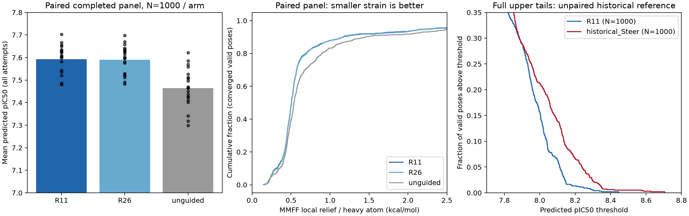

# 当前生成与对照比较

固定快照：2026-10-09T18:36:17.832887+08:00。R11 已完成注册的 1000 次生成；R26 与无引导各完成 1000 个可成对评估的样本，共同批次 [55, 56, 57, 58, 59, 60, 61, 62, 63, 64, 65, 66, 67, 68, 69, 70, 71, 72, 73, 74]。三个方法均完成全部注册批次，完整生成任务已结束。

只读检查：2026-10-09T18:36:17.832887+08:00；后台任务已于 2026-10-09T16:31:27.822605+08:00 完成。

主要结果：Gradient guidance 相对无引导的差异应以共同批次的配对比较判断；Steer 为历史非配对参照。当前记录不更换奖励函数、默认配置或推理结果。

## 相同初始随机状态的完整对照

每组使用同一批次/slot，初始坐标、原子及键状态签名一致。master seed=42，批次种子为 42+100003×batch；推理共 100 步。

|组别|N|全部尝试 pIC50 均值|有效/PB fast|有效分数 P95/最高|极高分有效数/独立图|应变中位/P90|
|---|---:|---:|---|---|---|---|
|R11|1000|7.592783|97.10%/96.80%|8.112041/8.444852|8/5|0.506528/1.167555|
|R26|1000|7.590488|97.10%/96.70%|8.111982/8.444835|7/4|0.506059/1.167335|
|unguided|1000|7.464231|95.50%/94.70%|8.103166/8.350092|5/4|0.538684/1.452546|

极高分阈值为既定值 8.258901978，没有根据本次结果重新选择。

R11_vs_unguided：全部尝试配对均值差 +0.128552，批次 bootstrap 95% 区间 [+0.090039, +0.167505]；19/20 批均值为正。逐样本中位差 +0.027633，至少 +0.01 的样本 525 个，至多 −0.01 的样本 357 个。

R11_vs_R26：全部尝试配对均值差 +0.002295，批次 bootstrap 95% 区间 [-0.005035, +0.009124]；14/20 批均值为正。逐样本中位差 -0.000007，至少 +0.01 的样本 46 个，至多 −0.01 的样本 45 个。

R26_vs_unguided：全部尝试配对均值差 +0.126257，批次 bootstrap 95% 区间 [+0.091560, +0.161670]；20/20 批均值为正。逐样本中位差 +0.027581，至少 +0.01 的样本 524 个，至多 −0.01 的样本 359 个。

R11 相对无引导的配对均值提升为 +0.128552；当前对照没有证据证明 R11 优于 R26。差异体现在少数生成路径上：R11 与 R26 的 909/1000 个 slot 分数差绝对值小于 0.01。先前六个独立批次的 +0.021049 优势不应直接外推到这些新批次；需要把当前的批次依赖纳入最终结论。

完整 20 个新批次均已评估。区间按批次重采样 2,000 次，随机种子 42；没有将同一批次的 50 个分子视为 50 个独立重复。

## 相同最终尝试数的历史参照

|组别|N|全部尝试 pIC50 均值|有效/PB fast|有效分数 P95/最高|极高分有效数/独立图|应变中位/P90|
|---|---:|---:|---|---|---|---|
|R11|1000|7.592783|97.10%/96.80%|8.112041/8.444852|8/5|0.506528/1.167555|
|historical_Steer|1000|7.651480|96.10%/96.00%|8.236081/8.704806|37/23|0.530322/1.380943|

R11 相对 Steer 的全部尝试均值差为 -0.058697；最高有效分数差为 -0.259954。极高分产率分别为 0.80% 和 3.70%，达到阈值的独立化学图分别为 5 和 23。

R11 应变中位数比 Steer 低 4.5%，P90 低 15.5%。这反映本地同图松弛的能量变化，不直接证明结合自由能更好。

有效独立化学图数：R11=350，Steer=401；不能将某些坐标方向上的自由度增加等同于最终图多样性必然增加。

先前 300 样本确认使用不同批次，不能将它与本次 1,000 样本的最高分差异完全归因于数量。

## 如何解释当前结果

R11 的质量结果须分别考察整体分布和极高亲和力尾部。扩大生成数量能够增加发现稀有路径的机会，但如果单位尝试的极高分产率没有提升，仅增加数量不会复现在线筛选的选择压力。Steer 根据在线分数复制较优父代，再继续生成；当前 guidance 依据历史空间奖励修正单条路径，没有在线亲和力筛选。因此，保留和扩增极高分路径仍可能是 Steer 的主要优势。这个机制解释与结果相符，但本比较没有进行新的因果消融，不能据此排除其他因素。

历史 Steer 使用批次 0–19；当前使用 55–74，不能逐 slot 配对。历史 Steer 的 700 个设计供体参与了奖励构建，且在线评分/重采样预算更多。所以 N=1,000 的比较是同尝试数的描述性参照，而不是独立训练外、等计算量的胜负检验。

## 执行与评估边界

R11/R26 在输入声明的 [0.0, 0.5] 学习窗口执行 [50] 次有效坐标更新，窗口结束后原生续推至 1.0；无引导没有坐标注入。100 步均无粒子重采样，使用真实 FLOWR 端点 Jacobian 的反传，没有对 affinity head 求导，也没有额外的每步生产目标前向。preflight 额外前向属于一次数值验证，原生 untarget 诊断前向仍存在。

路径累计坐标注入 RMS（各步 RMS 求和，非终态位移）：R11 0.739614 Å，R26 0.739543 Å，无引导为 0。因此 R11/R26 结果接近不意味着 guidance 相对无引导没有执行。

目标为 CK2α 的 FLOWR 预测 pIC50，越高越好，尚未经过实验亲和力验证。均值保留所有尝试，包括结构无效的 slot；P95/最高分和极高分计数只使用有效结构。PB fast 是 PoseBusters dock_fast 的结构检查子集，不是完整的蛋白复合物验证。应变为 MMFF94s：先固定重原子松弛氢，再进行同一化学图的本地松弛，取能量下降/重原子数（kcal/mol）；仅汇总双重收敛者，并保留缺失/失败计数。

R11 收敛能量记录 971/971，Steer 961/961。新旧结构采用同一已固定评估流程；源数据校验和、程序、执行记录与统计定义见 comparison.json 和各组保留目录。

推理代码固定为 `006212f32ebd5070fa168ab319139ea429875fea`；远端后台 worker 使用独立固定源码快照，本次读取和分析没有改变它。

复用入口：`scripts/report_guidance_scale.py --help`。新报告需要提供本次两个数据集、已评估结果、历史 Steer 源表/固定元数据、既定 protocol/spec 和全新的输出路径。
