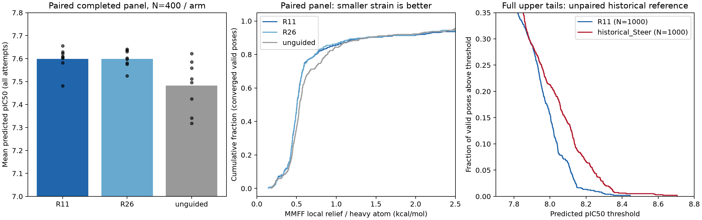

# 当前生成与对照比较

固定快照：2026-10-09T15:01:57.628918+08:00。R11 已完成注册的 1000 次生成；R26 与无引导各完成 400 个可成对评估的样本，共同批次 [55, 56, 57, 58, 59, 60, 61, 62]。捕获时完整对照任务仍在运行。派生快照的 COMPLETE 只证明该快照完成，不代表 1,000 样本任务完成。

后续只读检查：2026-10-09T15:14:19.801717+08:00，后台状态 running；无引导已结束 500 个样本，R26 已结束 500 个。这些新增批次没有混入下面已冻结并评估的统计。

主要结果：Gradient guidance 相对无引导的差异应以共同批次的配对比较判断；Steer 为历史非配对参照。当前记录不更换奖励函数、默认配置或正在运行的推理。

## 相同初始随机状态的部分对照

每组使用同一批次/slot，初始坐标、原子及键状态签名一致。master seed=42，批次种子为 42+100003×batch；推理共 100 步。

|组别|N|全部尝试 pIC50 均值|有效/PB fast|有效分数 P95/最高|极高分有效数/独立图|应变中位/P90|
|---|---:|---:|---|---|---|---|
|R11|400|7.598086|97.25%/97.00%|8.114157/8.444852|3/3|0.506580/1.383131|
|R26|400|7.598409|97.75%/97.50%|8.113919/8.444835|2/2|0.505341/1.345055|
|unguided|400|7.482155|93.75%/93.50%|8.108827/8.350092|2/2|0.540234/1.392519|

极高分阈值为既定值 8.258901978，没有根据本次结果重新选择。

R11_vs_unguided：全部尝试配对均值差 +0.115931，批次 bootstrap 95% 区间 [+0.049298, +0.186028]；7/8 批均值为正。逐样本中位差 +0.010417，至少 +0.01 的样本 200 个，至多 −0.01 的样本 150 个。

R11_vs_R26：全部尝试配对均值差 -0.000322，批次 bootstrap 95% 区间 [-0.016026, +0.013474]；5/8 批均值为正。逐样本中位差 +0.000001，至少 +0.01 的样本 19 个，至多 −0.01 的样本 18 个。

R26_vs_unguided：全部尝试配对均值差 +0.116254，批次 bootstrap 95% 区间 [+0.055809, +0.179183]；8/8 批均值为正。逐样本中位差 +0.012123，至少 +0.01 的样本 201 个，至多 −0.01 的样本 150 个。

R11 相对无引导的配对均值提升为 +0.115931；当前部分对照没有证据证明 R11 优于 R26。差异体现在少数生成路径上：R11 与 R26 的 363/400 个 slot 分数差绝对值小于 0.01。先前六个独立批次的 +0.021049 优势不应直接外推到这些新批次；需要把当前的批次依赖纳入最终结论。

8 个批次仍是部分结果。区间按批次重采样 2,000 次，随机种子 42；没有将同一批次的 50 个分子视为 50 个独立重复。完整 20 批对照结束后才能给出完整判定。

## 相同最终尝试数的历史参照

|组别|N|全部尝试 pIC50 均值|有效/PB fast|有效分数 P95/最高|极高分有效数/独立图|应变中位/P90|
|---|---:|---:|---|---|---|---|
|R11|1000|7.592783|97.10%/96.80%|8.112041/8.444852|8/5|0.506528/1.167555|
|historical_Steer|1000|7.651480|96.10%/96.00%|8.236081/8.704806|37/23|0.530322/1.380943|

R11 相对 Steer 的全部尝试均值差为 -0.058697；最高有效分数差为 -0.259954。极高分产率分别为 0.80% 和 3.70%，达到阈值的独立化学图分别为 5 和 23。

R11 应变中位数比 Steer 低 4.5%，P90 低 15.5%。这反映本地同图松弛的能量变化，不直接证明结合自由能更好。

有效独立化学图数：R11=350，Steer=401；不能将某些坐标方向上的自由度增加等同于最终图多样性必然增加。

当前 R11 的前 400 个样本已找到最高有效分数 8.444852，完整 1000 个为 8.444852；极高分有效计数由 3 增至 8。同一固定样本流内的累计结果表明，增加生成数带来更多命中，但本次没有缩小最高分与 Steer 的差距。先前 300 样本确认使用不同批次，因此不能将它与本次 1,000 样本的最高分差异完全归因于数量。

## 如何解释当前结果

R11 的质量结果须分别考察整体分布和极高亲和力尾部。扩大生成数量能够增加发现稀有路径的机会，但如果单位尝试的极高分产率没有提升，仅增加数量不会复现在线筛选的选择压力。Steer 根据在线分数复制较优父代，再继续生成；当前 guidance 依据历史空间奖励修正单条路径，没有在线亲和力筛选。因此，保留和扩增极高分路径仍可能是 Steer 的主要优势。这个机制解释与结果相符，但本比较没有进行新的因果消融，不能据此排除其他因素。

历史 Steer 使用批次 0–19；当前使用 55–74，不能逐 slot 配对。历史 Steer 的 700 个设计供体参与了奖励构建，且在线评分/重采样预算更多。所以 N=1,000 的比较是同尝试数的描述性参照，而不是独立训练外、等计算量的胜负检验。

## 执行与评估边界

R11/R26 在输入声明的 0–0.5 学习窗口执行 50 次有效坐标更新，0.5–1.0 原生续推；无引导没有坐标注入。100 步均无粒子重采样，使用真实 FLOWR 端点 Jacobian 的反传，没有对 affinity head 求导，也没有额外的每步生产目标前向。preflight 额外前向属于一次数值验证，原生 untarget 诊断前向仍存在。

路径累计坐标注入 RMS（各步 RMS 求和，非终态位移）：R11 0.739614 Å，R26 0.739580 Å，无引导为 0。因此 R11/R26 结果接近不意味着 guidance 相对无引导没有执行。

目标为 CK2α 的 FLOWR 预测 pIC50，越高越好，尚未经过实验亲和力验证。均值保留所有尝试，包括结构无效的 slot；P95/最高分和极高分计数只使用有效结构。PB fast 是 PoseBusters dock_fast 的结构检查子集，不是完整的蛋白复合物验证。应变为 MMFF94s：先固定重原子松弛氢，再进行同一化学图的本地松弛，取能量下降/重原子数（kcal/mol）；仅汇总双重收敛者，并保留缺失/失败计数。

R11 收敛能量记录 971/971，Steer 961/961。新旧结构采用同一已固定评估流程；源数据校验和、程序、执行记录与统计定义见 comparison.json 和各组保留目录。

推理代码固定为 `006212f32ebd5070fa168ab319139ea429875fea`；远端后台 worker 使用独立固定源码快照，本次读取和分析没有改变它。

复用入口：`scripts/report_guidance_scale.py --help`。新报告需要提供本次两个数据集、已评估结果、历史 Steer 源表/固定元数据、既定 protocol/spec 和全新的输出路径。
