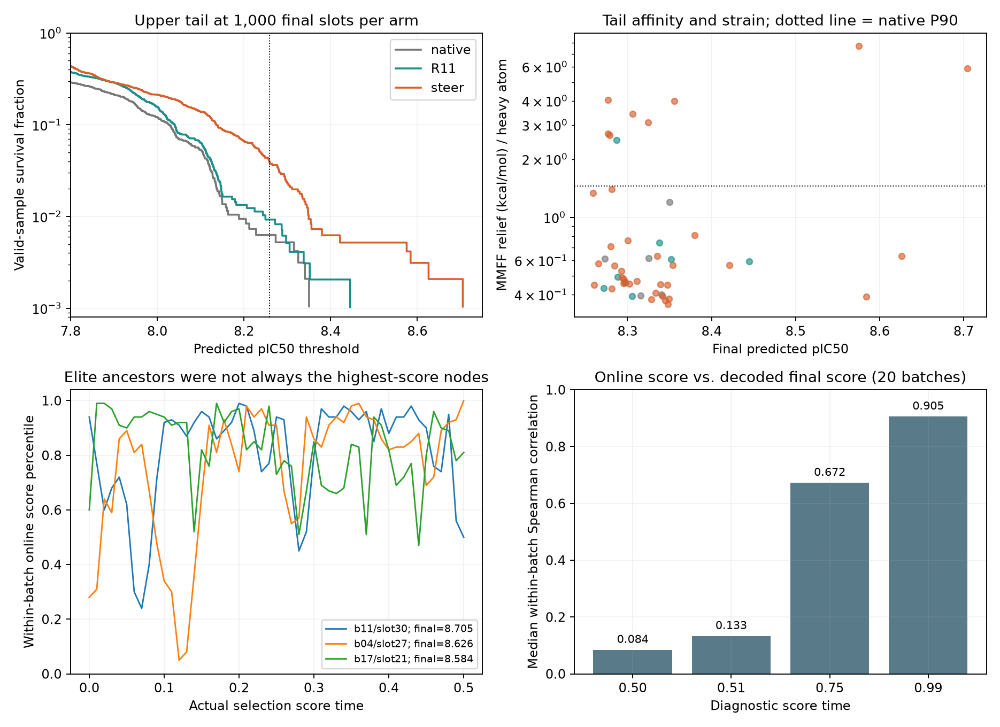
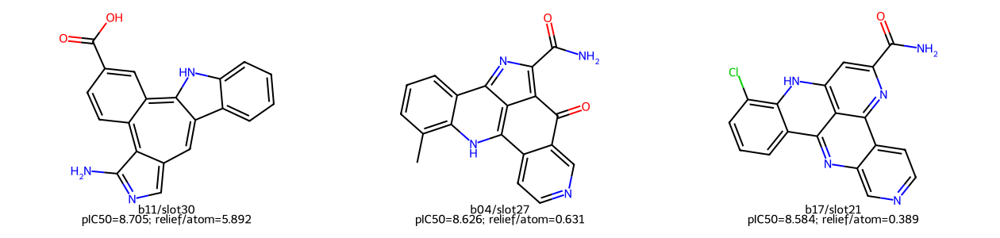

# 原始 Steer 高预测亲和力尾部的结构与谱系

2026-10-09。分析原始 single-arm Steer 的全部 20 批、1,000 个终态，读取原始结构与完整谱系。此轮没有新生成、修改奖励、增加筛选或限制化学图变化。高分指 FLOWR affinity head 的预测 pIC50，不是实测结合亲和力。

**结论：尾部优势仍存在，但不能解释为“每一步都找到并保留最优分子”。** Steer 通过反复软选择让部分谱系获得更多后续生成机会；这些谱系在原生随机生成中继续分化，产生高分与普通分子。部分最高预测分伴随高应变，另一些高分分子的应变接近常规水平。当前没有统计确认一个适用于全部尾部样本的单一空间 motif。

**尾部的量化定义与能量条件。** 阈值固定为 8.258901977539063，来源于先前发现集阈值，不因本次结果调整。四组均为 1,000 个最终槽位。无引导与 R11/R26 是同初始状态的新批次 55–74；历史 Steer 是批次 0–19，并非同随机路径配对，计算预算也没有匹配。

| 指标 | 无引导 | R26 gradient | R11 gradient | 历史 Steer |
|---|---:|---:|---:|---:|
| 有效终态数 | 955 | 971 | 971 | 961 |
| 有效高分尾部数 | 5 | 7 | 8 | 37 |
| 尾部唯一化学图数 | 4 | 4 | 5 | 23 |
| 有效终态最高预测 pIC50 | 8.350092 | 8.444835 | 8.444852 | 8.704806 |
| 同时符合应变条件的尾部数 | 5 | 7 | 7 | 29 |
| 符合应变条件的尾部唯一化学图数 | 4 | 4 | 4 | 15 |
| 符合应变条件的最高预测 pIC50 | 8.350092 | 8.444835 | 8.444852 | 8.625889 |

应变条件为 PB fast 通过、MMFF 两次局部优化收敛，且 MMFF94s 局部松弛能差/重原子 ≤ **1.45254600955 kcal/mol/atom**。该上限是原无引导有效样本应变的 P90，先从无引导确定再用于其他组。PB fast 是结构检查子集；通过不代表完整复合物验证或低应变。MMFF 能差也不等于结合自由能。

Steer 的 37 个尾部来自 10 批；其中 34 个来自用于历史规则发现的批次 0–13，3 个来自批次 14–19。因此该表是历史参考比较，不能作为完全独立、相等计算成本的因果验证。Steer 的整体唯一有效化学图为 401，低于无引导的 515；这里讨论的是**高分尾部中的多样性**。



**这些终态具有什么特征。** 本次计算 94 项特征：40 个 CK2 受体残基区域的全重原子软距离/软接触比例（80 项）、四项点云形状，以及十项次级化学图描述。区域由参考配体周围 8 Å 自动选取；归一化 soft-min 温度 0.25 Å，软接触中点 4.5 Å、宽度 0.5 Å。坐标来自未经松弛的原始解码 SDF。

| 描述性特征 | 尾部 37 个终态 | 其余有效 Steer 终态 |
|---|---:|---:|
| 重原子数 | 全部 25（本实验固定大小） | 同一固定大小设定 |
| 环数 | 35 个为 5 环、2 个为 4 环 | 中位数同样为 5 环 |
| 芳香重原子比例，中位数 | 0.88 | 0.84 |
| 可旋转键数，中位数 | 1 | 1 |
| 羧基匹配 | 31/37 | 此类基团在普通样本中也常见 |
| 回转半径，中位数 | 3.64974 Å | 3.59986 Å |
| 点云法向厚度，中位数 | 0.09205 Å | 0.10411 Å |

“厚度”是重原子点云最小协方差特征值的平方根；“平面度比例”是该特征值/协方差迹。没有跨分子的原子编号匹配或人为刚体对齐。点云尺度/厚度仅描述几何，不判断图是否天然或有效。

这些分子多数属于较刚性的多环、近乎平面的空间形状。**这类描述不是已确认的尾部富集 motif。** 为控制批次与复制影响，每批、每个标签内先按相同化学图平均多个构象，再给化学图等权，最后计算有尾部的 10 批的成对差异。一个化学图在尾部出现 13 次；这些复制不应成为 13 份独立证据。图描述的成对检验均未达到显著性（本次 q 均为 1）。

坐标差异最一致的方向是厚度略减、平面度比例略减；局部残基接触同时有靠近和远离，未发现“所有区域都更紧密”的规律。

| 候选方向，批次等权且图等权 | 全尾部平均差异 | 全尾部 q | 应变条件内平均差异 | 条件内 q |
|---|---:|---:|---:|---:|
| 点云厚度 | −0.01306 Å | 0.08203 | −0.01457 Å | 0.05469 |
| 平面度比例 | −0.000326 | 0.08203 | −0.000367 | 0.05469 |
| GLY177 软距离 | −0.03725 Å | 0.08203 | −0.03890 Å | 0.05469 |
| ASN117 软距离 | +0.04653 Å | 0.08203 | +0.04616 Å | 0.06310 |
| LYS68 软接触比例 | +0.00296 | 0.08203 | +0.00293 | 0.06152 |
| GLU114 软接触比例 | +0.00595 | 0.15313 | +0.00548 | 0.06152 |

统计采用成对 Wilcoxon，按坐标/图两个特征家族分别做 BH 校正；置信区间是固定 seed 42 的批次 bootstrap（5,000 次）。**84 项坐标特征中，没有一项达到预设 q＜0.05。** 校正前方向一致、部分均值区间不跨零，仍只能作为探索线索。距离变化只有数百分之一 Å，接触比例变化也很小，不能直接推出氢键、盐桥或相互作用能量机制。

一个更直接的空间证据来自同化学图的两个高分构象：batch 4、slot 27 和 slot 37 的图相同，预测 pIC50 分别 8.625889 与 8.421457，应变分别 0.631318 与 0.565867。按精确图同构进行原子匹配、保持受体坐标框架不做刚体叠合，重原子 RMS 为 **0.675458 Å**。这表明姿态/构象差异能够伴随明显的预测分差异，不能把尾部差异仅归于原子组成或化学图类别。它还不是哪个具体空间变化具有因果作用的证明。

**最高分并不必然是最佳综合质量。** 三个示例：

| 最终节点 | 预测 pIC50 | MMFF 松弛能差/重原子 | 判断 |
|---|---:|---:|---|
| single_b011_final_030 | 8.704806 | 5.892297 | 最高预测分，但高应变 |
| single_b004_final_027 | 8.625889 | 0.631318 | 高预测分且应变条件内 |
| single_b017_final_021 | 8.584398 | 0.389233 | 高预测分且应变条件内 |

另一个 batch 11 样本（slot 27）预测分 8.575342、应变 7.686973。Steer 尾部整体应变中位数为 0.561684，不能用中位数掩盖这些极端值，也不能据此否定其余 29 个符合应变条件的尾部样本。



**这些 sample 如何产生。** 原始 single-arm 实验每批 50 个粒子。模型在当前状态给出 endpoint 预测与 on-target head 分数 aᵢ，原生积分先得到 proposed state。单目标复制概率为 pᵢ＝exp(aᵢ)/Σⱼexp(aⱼ)，随后按概率有放回抽取 50 个索引。实际单目标概率与本次重算 softmax 的最大误差低于 2×10⁻⁶；全部 20 批均验证了坐标复制和根传播一致性。

这一步复制的是状态及相应上下文，不对 affinity head 求导，也不沿奖励梯度修改坐标。名字中 `guidance` 的字段在这里指 importance resampling。随后坐标/离散随机积分使相同父节点的后代重新分化。[上游实现](https://github.com/jule-c/flowr_root/blob/739a33c2aab74d074dd24605b9a2e34dc809ae9c/flowr/models/fm_pocket.py)；本次单目标控制逻辑由原始归档的 `scripts/run_lineage.py::Trace.choose` 明确记录。

条件期望复制数为 E[kᵢ]＝50pᵢ。两节点相差 Δa 时，复制机会之比为 exp(Δa)，不是 10 的 Δa 次方。例如 Δa＝0.2 时机会之比约 1.22。最高分不是强制保留；任一节点零复制的概率为 (1−pᵢ)⁵⁰，普通 p≈1/50 节点约为 0.364。尾部祖先即使某一步排名下降，仍有机会继续生成；未复制节点的未来结局未被观测，不等于最终一定低亲和力。

本实验实际重采样评分节点为 0、0.01、…、0.50，共 **51 次**；最后一次复制的是积分后 t＝0.51 的状态，然后继续原生生成至终态。当前 R11/R26 的严格学习/引导范围是状态不超过 0.5 的 50 次更新，随后无引导。这里报告本实验实录，不把它当作论文 CK2 案例未公开的全部精确设置。

**谱系收缩与再次分化。** 全部 20 批中，当前群体初始根数中位数沿 t＝0、0.1、0.2、0.3、0.4、0.5 分别约为 50、6、2.5、1、1、1。最终 1,000 个槽位只来自 23 个初始根；其中 17 批只剩一个初始根，3 批有两个。ESS 平均仍为 47.716/50，说明每次概率并没有极端集中；反复有放回复制本身也会造成遗传漂变和根丢失。因此收缩不能全部归为确定性的“最佳根选择”。

37 个尾部来自 10 个初始根，分别属于 10 批，每批尾部共用一个初始根。其初始 head 排名范围为第 28–96 百分位，平均 67.6 百分位，均非初始第一名。以 batch 4、slot 27 为例：

| 评分时间 | 祖先槽位 | on-target head 预测分 | 批内评分百分位 |
|---|---:|---:|---:|
| 0.00 | 25 | 7.8067 | 28% |
| 0.10 | 22 | 8.3933 | 34% |
| 0.20 | 45 | 8.6446 | 74% |
| 0.30 | 15 | 8.5509 | 86% |
| 0.40 | 21 | 8.5837 | 84% |
| 0.50 | 39 | 8.7021 | 100% |
| 终态 | 27 | 8.6259（解码后重评分） | 另一个评价语义 |

表仅展示代表节点；实际分析使用每个选择节点，没有分成 0–0.1 等时间段。原始分数随时刻改变预测条件/校准，不是实验亲和力随时间增长。

**停止筛选后的分化非常关键。** 最后一次筛选中，batch 4 的父节点 39 被复制到子槽位 24、27。在 t＝0.51，它们的坐标、原子、化学键、电荷、mask 均逐元素完全相同，最终分别得到：

| 子槽位 | 最终预测 pIC50 | 应变 | 最终图 |
|---|---:|---:|---|
| 24 | 7.822988 | 0.607031 | 与 27 不同的有效图 |
| 27 | 8.625889 | 0.631318 | 高分尾部图 |

它们的最终预测分相差 **0.802901**。化学图变化是联合生成的一部分，不能把“图不同”作为质量下降原因或据此禁止图改变。在本例中，没有足够证据把分差归于单一几何区域、原子类型或键变化。

整个尾部对应 36 个不同的最后选择父节点，其中 23 个有多个复制后代；**22 个父节点同时产生了高分尾部与其他有效后代**。仅依赖相同窗口内状态的确定性奖励，会给复制后代相同的局部梯度，不能唯一标识其不同未来随机轨迹。它可以提高成功概率，但不能由该状态保证复现某个最终高分后代。

在线分数与最终解码重评分之间的批内 Spearman 相关性中位数：

| 诊断评分时间 | 0.50 | 0.51 | 0.75 | 0.99 |
|---|---:|---:|---:|---:|
| 20 批相关性中位数 | 0.083841 | 0.132627 | 0.671950 | 0.905088 |

0.50 的相关性是按最终槽位回溯到其真实祖先、对有效终态计算，重复祖先作为原本的后代观测保留；它是后代相关性诊断，不是以复制数增大有效统计样本量的假设检验。0.51/0.75/0.99 仅用于说明后续分化，未进入选择窗口特征挖掘。

**这如何解释与 Gradient guidance 的差距。** 已确认的差别是 Steer 每次用当前模型分数重新分配后续生成机会；R11/R26 在学习范围内优化离线坐标代理，再在其后继续原生推理，没有在线 affinity 目标梯度或重采样。这些系统的作用机制不同。

当前 R26 主目标不是单个平均构象：它对最近 K＝4 个老师点云使用平滑 mixture reward，确实保留多个备选模式。不能把差距简单解释为“实现只学了一个平均分子”。但最近老师选择、每批最多两个老师、信用标签的压缩与点云空间指标，都可能让远处稀有高分路径获得不足的引导；这属于由实现和数据推导出的候选原因，尚未完成逐项因果消融。旧终端信用使用 t＝0.99 联合潜变量 head 后代均值，也不是本报告采用的最终解码重评分。

更关键的是，很多早期优劣终态共享完全相同祖先；在 t＝0.5，仅复制状态就能在后续原生推理中产生很大的终态分差。只拟合窗口内的几何相似度，无法自动等价于提高终态高分尾部的概率。相同样本输出数量也不等于相同的反馈策略或计算预算。

因此后续奖励挖掘应区分：能产生高分后代的谱系、只有当前在线分高的节点、以及某个最终成功分子的静态形状。值得检验的是尾部后代比例/上分位信用、同父分支的联合空间变化、优势局部与周围区域的共同适配，及窗口边界后的坐标创新与终态分化。当前证据不支持把羧基、固定残基接近方向或整体更平面直接写成强制规则。

**变化是否能拟合成函数。** 本次附带保存连续选择节点的二次描述拟合与导数。例如尾部祖先的批次等权在线分均值近似为 a(t)≈8.40353＋2.39114t−5.23612t²，R²≈0.7093。该拟合跨 0–0.5 实际节点，不使用时间区间桶。它描述模型在线分曲线，不是空间 reward；da/dt 更不是 ∇ₓR。形状曲线也同样保存，没有把时间导数直接注入生成。

**复核与文件。**

- [紧凑统计与原始文件指纹](summary.json)：20 批轨迹/SDF 与配置、指标表的 SHA256，特征参数和代码指纹。
- [尾部质量比较](quality_tail_panel.csv)、[逐尾部终态特征](elite_terminal_features.csv)、[同图构象比较](same_graph_tail_poses.csv)。
- [逐尾部祖先轨迹](elite_paths.csv)、[选择群体](selection_population.csv)、[同父后代分化](exit_sibling_fates.csv)、[后半程相关性诊断](suffix_correlations.csv)。
- [成对特征检验](terminal_contrasts.csv)、[应变条件内检验](qualified_terminal_contrasts.csv)、[连续事件趋势](selection_trend_curves.csv)、[拟合与导数](descriptive_trend_fits.json)。
- [分析入口](../../../scripts/analyze_steer_affinity_tail.py)、[绘图入口](../../../scripts/plot_steer_affinity_tail.py)、[实现](../../../src/evomolsteer/continuous/affinity_tail.py)、[测试](../../../tests/test_affinity_tail.py)。

没有保存全体分子的扩展特征缓存、坐标副本或模型拟合参数；统计与谱系输出合计约 1.2 MB。主要统计已验证全部 20 批的父子复制、根传播、softmax 概率与终态图一致性。新增 5 项测试覆盖刚体不变/缺失坐标、复制权重、多重检验、混合 arm 隔离和无分桶拟合；与 9 项既有比较测试一并通过。

复现命令（仓库根目录，输入保持不变）：

```powershell
.venv/Scripts/python.exe scripts/analyze_steer_affinity_tail.py --root data/raw/ck2_clk3_lineage_20261003 --campaign main1000_w050 --metrics docs/experiments/guidance_vs_steer_20261007/steer_full1000/candidate_metrics.csv --analysis-config configs/single_target_analysis.json --threshold 8.258901977539063 --output results/steer_tail_20261009 --comparison 'native=results/flowcompat_scale1000/controls_full/candidate_metrics.csv#unguided' --comparison 'R26=results/flowcompat_scale1000/controls_full/candidate_metrics.csv#gradient' --comparison R11=results/flowcompat_scale1000/R11_full/candidate_metrics.csv
.venv/Scripts/python.exe scripts/plot_steer_affinity_tail.py --analysis results/steer_tail_20261009 --output docs/experiments/steer_tail_20261009/figures --metrics 'native=results/flowcompat_scale1000/controls_full/candidate_metrics.csv#unguided' --metrics R11=results/flowcompat_scale1000/R11_full/candidate_metrics.csv --metrics steer=docs/experiments/guidance_vs_steer_20261007/steer_full1000/candidate_metrics.csv
.venv/Scripts/python.exe -m pytest tests/test_affinity_tail.py tests/test_scale_comparison.py -q
```
