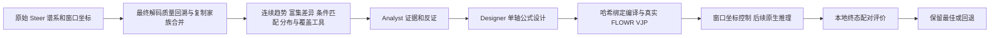

# 最终解码标签回溯与动态坐标奖励：TO01–TO15 完成报告

本次 15 轮已完成。TO01–TO13 为固定开发粒子的顺序探索，TO14–TO15 为预先冻结候选的独立批次验证。R11/R26 指历史奖励与代码配置，使用同一份 FLOWR.ROOT v2 权重；不是不同模型权重。本报告中的方向、数值和回退记录均可从逐轮保留文件重建。

本轮是单目标 on-target 预测亲和力优化，主字段为 pic50_on_rescore。Off-target 亲和力和 gap 仍保存在逐分子表中作诊断，不把它们算作本轮奖励目标，也不宣称完成了多目标选择性优化。

**最终处置：** 冻结的最终回溯标签候选优于无引导，但未超过历史R11/R26，且应变尾部恶化；不提升为当前最佳。本轮执行配置已恢复历史R11的动态时钟匹配版本（控制至实际proposal .51），保留原始Steer、失败候选与全部证据。

当前本轮 active_program.json 是历史 R11 时钟匹配配置的逐字节副本，仍用即时 on-target 教师分数；没有把未通过比较的最终家族均值/尾部收缩偷偷合入最佳配置。新的 Analyst/Designer 最终回溯工具保留为研究流程，与当前已采纳的生成配置分开。

## 独立验证与原始 Steer 参照

四个验证臂每臂 200 个分子、批次 133–136，初始坐标/原子/键状态逐批签名匹配。原始 Steer 为历史 1,000 个输出，样本数量与搜索过程不同，属于未配对参照。

| 方法 | n/有效数 | 全 slot 预测 pIC50 均值 | 有效均值 | 有效 p95 / 最大值 | 高分有效数/独立图 | MMFF 应变中位数 / p90 |
|---|---:|---:|---:|---:|---:|---:|
| TO12 冻结候选 | 200/195 | 7.633942 | 7.636996 | 8.086162 / 8.293632 | 2/2 | 0.522658 / 1.553815 |
| 无引导 | 200/192 | 7.530786 | 7.536281 | 8.110476 / 8.405094 | 2/2 | 0.538189 / 1.142430 |
| 历史 R11，控制到 .51 | 200/194 | 7.660547 | 7.664312 | 8.109842 / 8.362625 | 3/3 | 0.506815 / 1.036520 |
| 历史 R26，控制到 .51 | 200/192 | 7.657384 | 7.664518 | 8.103129 / 8.362710 | 3/3 | 0.509842 / 0.942021 |
| 原始 Steer（未配对） | 1000/961 | 7.651480 | 7.645519 | 8.236081 / 8.704806 | 37/23 | 0.530322 / 1.380943 |

亲和力先报告全 slot 与有效样本两种均值，避免过滤无效结果后掩盖退化。全 slot 分数含无效解码，不能代表可用分子的结合能力。高分阈值为预先记录的 8.258901977539063。应变是收敛的 MMFF94s 同图局部松弛能量下降/重原子（kcal/mol/重原子），不是结合自由能；逐臂收敛数在汇总 JSON 中保留。

| 冻结候选相对 | 配对全 slot pIC50 差 | 批次 bootstrap 95% 区间 | 4 个批次差 |
|---|---:|---|---|
| native | +0.103157 | [0.031805, 0.165327] | -0.011444, 0.169101, 0.093417, 0.161552 |
| R11_051 | -0.026604 | [-0.064940, 0.011732] | -0.075097, 0.008800, 0.014663, -0.054784 |
| R26_051 | -0.023442 | [-0.064946, 0.018062] | -0.075286, 0.023562, 0.012563, -0.054607 |

仅 4 个批次，区间与稳定性证据有限；开发粒子被重复用于适应性调参，不能与验证臂合并作独立样本。预测亲和力不是实验亲和力。

## 每轮方向、原因及实测结果

| 轮次 | 改动与原因 | 全 slot / 有效均值 | 有效数 | 对无引导的配对差 | 应变中位数 / p90 | 推理 commit |
|---|---|---:|---:|---:|---:|---|
| TO01 | **R26 时钟匹配控制**：先建立控制到实际 proposal .51 的历史基准；此轮仍用即时教师标签。 | 7.558654 / 7.561386 | 99 | +0.033527 | 0.519351 / 1.003577 | 598656f9ab |
| TO02 | **R11 时钟匹配控制**：保留历史小质量虚拟分支，建立相同初始状态的另一基准。 | 7.572395 / 7.575265 | 99 | +0.047267 | 0.518349 / 0.987445 | 3d14dc9c75 |
| TO03 | **R26 改为最终后代均值标签**：检验即时高分是否带偏教师选择；初次使用最终解码回溯标签。 | 7.578448 / 7.585683 | 97 | +0.053321 | 0.542668 / 1.697416 | 8a89555aa1 |
| TO04 | **R11 改为最终后代均值标签**：在较好历史基础上复测标签方向；保持 FLOWR Jacobian 与剂量。 | 7.589413 / 7.596988 | 97 | +0.064285 | 0.540590 / 1.332651 | b8fde9fe64 |
| TO05 | **复制状态合并最终家族先验**：相同状态不能因幸运后代获得不同几何价值；先固定教师点，只改变家族先验。 | 7.600074 / 7.611987 | 96 | +0.074946 | 0.537597 / 1.171195 | b8e1de98be |
| TO06 | **家族合并后再排序教师**：消除先挑幸运复制分支、再坐标去重的问题；26/714 个教师选择事件改变。 | 7.608208 / 7.611456 | 98 | +0.083081 | 0.537390 / 1.082702 | ee8a16be2c |
| TO07 | **同祖先、相近即时分的匹配方向**：隔离粗即时分差异，测试局部占据、接触、位移和速度；实际稀疏方向降低亲和力，回退 TO06。 | 7.602980 / 7.610981 | 97 | +0.077852 | 0.537844 / 1.179525 | 08a78454c6 |
| TO08 | **家族均值 + 0.5 高分后代比例**：奖励产生高质量后代的分布，而非单个最大值；提高亲和力但应变尾部偏大。 | 7.622143 / 7.626869 | 97 | +0.097016 | 0.523454 / 1.794114 | fc72635f02 |
| TO09 | **尾部比例权重降至 0.25**：减轻尾部项对均值目标的挤占；有效率下降说明仍有质量权衡。 | 7.624641 / 7.641469 | 93 | +0.099513 | 0.537622 / 1.603939 | 65019267f7 |
| TO10 | **每批教师预算 2→4**：增加最终优质路径的覆盖；覆盖上升却未改善生成亲和力，回退 TO09。 | 7.619524 / 7.627744 | 97 | +0.094396 | 0.538468 / 1.535980 | 15cd47e3e8 |
| TO11 | **局部教师邻居 4→6**：检验多模式是否改善搜索覆盖；亲和力与应变均不利，回退 TO09 的 4 邻居。 | 7.585286 / 7.603212 | 95 | +0.060159 | 0.537614 / 1.840048 | 36e3d36502 |
| TO12 | **尾部计数收缩强度 2**：降低单一幸运后代对尾部先验的影响；保持教师坐标、选择和均值不变。 | 7.635824 / 7.641489 | 96 | +0.110696 | 0.537090 / 1.544112 | 8b40f9af11 |
| TO13 | **虚拟分支质量 0.025→0**：检验旧即时方向是否干扰最终标签；两个批次亲和力均下降，恢复 TO12 的 0.025。 | 7.617724 / 7.625854 | 95 | +0.092596 | 0.522940 / 1.300296 | d0b5423b1c |
| TO14 | **冻结 TO12，新批次 133/134**：停止调参，重跑候选、无引导、R11、R26；各臂 100 个输出。 | 7.633249 / 7.637500 | 96 | +0.078829 | 0.520331 / 1.081461 | 578e5da237 |
| TO15 | **同一冻结配置，新批次 135/136**：不根据 TO14 改配置；与 TO14 合并形成每臂 200 个输出、4 个批次的独立验证。 | 7.634636 / 7.636508 | 99 | +0.127484 | 0.533021 / 2.113920 | fffb094686 |

TO07、TO10、TO11、TO13 均未成为后续父配置。TO13 虽降低应变，但主目标在两个批次下降，因此立即恢复 TO12。TO14/TO15 是验证轮，不是两次新奖励优化。TO01/TO02 是历史控制，不宣称它们已有逐轮新 Designer 设计。完整父配置、负实验记录和哈希见每轮的 request、registry、rollback/selection 与 results 文件。

## Analyst 如何挖掘最终变优路径

通过 selected_indices 把最终解码 slot 精确追溯至窗口内每个祖先。保存后代数、有效比例、图内平均再图间等权的最终亲和力均值、分位数、高分比例及独立图数。当前状态完全相同的复制分支先验证坐标及化学状态，再合并最终后代身份；避免把随机后期差异误作已有坐标优势。灭绝分支未来未知，不能标成零分失败。原始节点标签平均约 90.43% 删失，因此本实验只能利用被 Steer 选择后的可观测后代；这些标签不等于未筛选生成的成功概率。

终态结构时钟为 1.0；统一 head rescore 用这一终态的坐标及 argmax 后的原子/键等类别，在 head 时钟 .9999 计算。它不是对 MMFF 松弛后的构象重新算亲和力，也不是对 RDKit 修正后图的独立打分；解码有效性由本地同一协议另外评估。

初始瞬时教师库在评分 0/.1 覆盖最终高分图 0/34，在 .49 为 10/34；全窗口平均图覆盖约 18.82%。评分 .5 与最终表现的批次中位 Spearman 相关约 .08384。这支持修正“只学习中间最高分”的标签偏差，但不足以证明所有晚熟路径已被恢复。TO06 的最终家族排序只改变 26/714 个事件，说明教师几何来源的可观测差异有限。

全窗口几何分析使用 74 个坐标特征（质心、协方差、点对距离核、20 个空间 landmark 的平滑距离/占据）及位移、速度，共 76 项。优势组与普通组按最终质量分位数动态定义，对每个事件算上/下四分位对比，再等家族、等批次汇总；跨批次检验并作 BH 多重校正。用全部 score window 的事件拟合连续二次函数 a·t²+b·t+c，保存拟合量及 2a·t+b 的变化率，不划分任意 0.1 子区间。时间变化率是统计描述，不是空间梯度。

这些曲线描述每个时刻可观测家族的优势对比；家族组成和未来支持量随筛选变化，因此不能把整条曲线解释成一个固定区域在同一群分子中的因果进化速率。PCA 等旧通用分析能力仍可复用，本次标签改造的主证据是全窗口对比、变化率、条件匹配和路径覆盖，没有把新增 PCA 结果当成奖励效能证明。

基础最终家族均值分析仅两项 landmark_08 软占据特征 q=.0385455，效应分别约 2.80×10⁻⁸、5.43×10⁻⁵；幅度极小，不足以认定因果化学 motif。共同祖父、不同直接父分支、即时分差≤.25 的扩展得到 266 对、264 个祖先、152/686 个支持事件；137 个条件匹配特征均未达到校正显著性，最小 q=.9753044。该方向库仅 101/1169 条教师记录有支持，并且 TO07 生成亲和力下降。报告没有把基础显著项误当成匹配显著项。

数值趋势可以拟合，但本轮没有证据把拟合导数直接变成可靠空间力。当前奖励主要使用随时刻变化的教师端点点云，而不是已证明有效的局部特征函数；也未获得生成模型模块注意力/归因证据，不能断言优势来自某个模型模块。接触只是几何代理，不是氢键或能量。

## Skills、tools 与 Designer 的实际响应

Analyst/Designer 由明确指定的 GPT6-Luna subagent 模拟。每次携带冻结 literal Skills、工具注册表、真实 receipt、输入输出哈希、已完成轮次的指标与当前父配置。Analyst 引用计算证据并写出反证；Designer 只能提交注册公式及一个允许变动轴。编译器绑定 request、Skills、receipt、Analyst 回复、参考库和父程序。保留真实 API 入口，本任务未调用外部 API；当前工具调用由 CLI/subagent 编排，不宣称 API 入口已经实现实时工具对话。

四份 Skills 分别约束角色分析、角色设计、最终标签时钟和家族/匹配/分布扩展。通用指引不硬编码分子 region、时间窗口或环境连接要求。TO11 追加负优化回退与不可修改已交付回复的指引；TO12 追加尾部计数收缩的统计限制。实际回复、工具运行及编译奖励均验证相应变化，而非仅修改文字。TO14/15 的 empty updates 则是刻意冻结，不是 Skill 失效。

新增 evidence-scope 工具按 disjoint ID 前缀区分基础与条件匹配证据；真实 Luna 调用返回 76/2 显著项与 137/0 显著项。曾出现两份未验证草稿的摘要/哈希错误，已保留草稿并生成明确 supersede 的 verified 文件；最终结论使用 verified 输出。纯报告工具未改变冻结的奖励、参考库或生成源码。

检验分成四层：指令输入绑定；计算实际执行且输入未变；编译程序与教师字段响应；真实 FLOWR 非零 VJP 与坐标注入。第一阶 VJP 响应不是第二次前向获得的奖励增益，也不是最终亲和力改善。详见 workflow_response_audit_TO10_TO12_verified.json、development_review_verified.json 和 scope_verified/。

## 可执行奖励、FLOWR 兼容性与时钟

当前候选家族 utility 为 μ_f+0.25·p̃_f，p̃_f=(n_f·p_f+2·p_batch)/(n_f+2)。μ_f 为最终有效后代的图等权均值；p_f 分母包含全部观察到的终态 slots（含无效解码），灭绝未知分支不填批次基准。该收缩是计数启发式，不是已校准原生概率或 Bayesian posterior。TO12 改变 510/1203 条先验，均值与教师点选择不变。

奖励在真实 FLOWR 端点 Y=f(X_t) 上求值：冻结 anchor 确定 Hungarian 原子置换与最近 4 个教师，先验考虑几何相近、最终家族 utility 与完整库的批次基础权重；用平滑点云代价的 log-sum-exp 多模式奖励，保留 .025 的有界虚拟分支。导数为 J_FLOWRᵀ·∇_Y R，而非 affinity head 求导。最近教师截取与质量加权后，实际 prior 不保证批次等权。完整公式、参数和源码定位见 reward_formula.zh-CN.md。

实际注入发生在原生随机推进之后，但方向来自步前 X_t 的端点 VJP，属于滞后一个积分步的控制；本步的 self-conditioning、类别和离散教师匹配固定。日志中的首阶梯度内积不能替代新 proposal 上重新计算的奖励值，这也是单步兼容性与终态效果需要分别验证的原因。

注入 RMS 以预测原生流的 .33 标定，单原子单步上限 .15 Å、逐步 RMS 注入之和的路径预算 6 Å，只有新严重受体碰撞的几何保护；无化学图相等 gate。25 个原子 slots 固定用于历史比较，但原子类型与化学图允许自然改变。这种点云奖励不能宣称已实现对整个自由分子空间的泛化。

整体奖励的正标量尺度通常会被梯度方向的 RMS 归一化抵消；不能仅乘一个全局系数便声称提高了控制强度。教师 utility、prior 和混合相对权重改变方向，native_rms_ratio 决定目标剂量，实际剂量再受 cap、路径预算和碰撞回溯影响。此轮没有改动冻结的 .33 剂量。

所有真实推理均为 100 步、51 个受控步至 state .51，然后 49 个原生步至 1.0。score 特征窗口由配置动态指定，本次 [0,.5]；末状态 .51 来自最后评分事件的 proposal 时钟。后半程采用原生 SDE、分类状态、自条件策略，与 Steer 关闭选择后的算法一致，但此前重采样造成 RNG 历史不同，不能保证随机轨迹逐项相同。没有粒子重采样、亲和力头梯度或额外逐步 production forward；一次性有限差分审计不属于每步生成开销。

基础 seed=42；独立批次使用现有控制器的确定性 seed 派生规则 42+batch_id×100003，因此不是每批都直接重新设为 42。候选与控制的批次 ID 相同，完整初始状态签名一致。

## 复现与保留

本地依次修改、commit、经已授权连接 push；远端先 pull、校验上轮结果保留清单、清理本任务生成载荷后执行 FLOWR 推理。结构包与逐文件 SHA 均验证后才进入本地科学分析。已保留逐最终分子 CSV、批次指标、Agent 输入输出、参考库、拟合/效应紧凑表、每轮执行/源代码证明与清理审计；省略可重建的大特征缓存。

重建入口：collect_outcome_round.py（显式输入包接口与校验）、score_outcome_round.py（本地完整终态评估）、summarize_outcome_campaign.py（只读已验证报告）、outcome_agent.py（tool/export/validate/compile/api）、dispatch_outcome_round.py（远端顺序生成）。每轮配置与 jobs manifest 在 configs/experiments/terminal_outcome15_v1/。计算过程用 family labels/reference/receipts 的哈希与对应 commit 可重放；报告不包含私人思维链。

验证结论针对当前单口袋、固定原子数与有限批次。最终回溯标签的可执行实现已完成；是否改善亲和力、构象或尾部必须分别由上面的独立结果判定。下一次探索应基于最终处置保留的配置，而非失败候选。

进一步研究应先解决数据含义：历史后代受 Steer 策略筛选，不能直接作为当前无重采样控制的价值函数。可考虑从相同窗口祖先进行预先规定的多次原生后续生成，校准后代均值、有效率与尾部不确定性，并对候选局部区域进行逐项作用/撤除比较；这些是后续建议，本次未执行，不计入十五轮成功结果。当前没有证据证明“最终标签一定优于即时标签”，也不把化学图变化本身解释成质量下降原因。

相关文件：aggregate/campaign_summary.json、aggregate/round_metrics.csv、final_decision.json、method.zh-CN.md、reward_formula.zh-CN.md、development_review_verified.json、retirement/。
